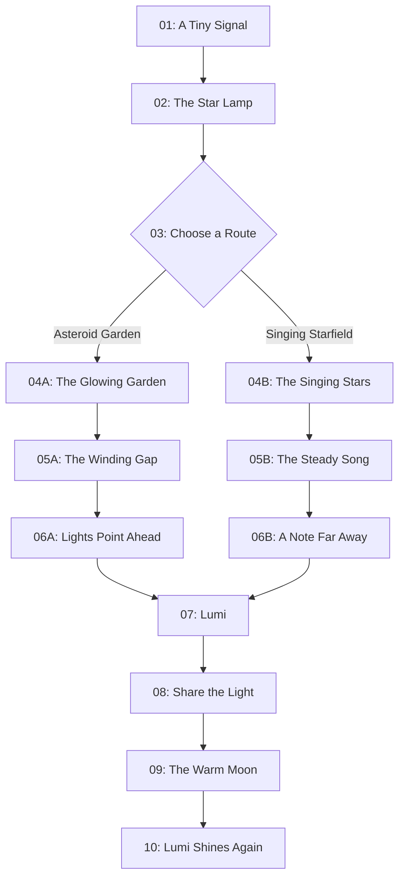

# Story Specification: The Starlight Rescue

**Indonesian title:** *Penyelamatan Cahaya Bintang*  
**Status:** Draft 1  
**Product:** Aby Little Book private family prototype  
**Audience:** Children aged 4–6  
**Target duration:** 5–7 minutes per completed route  
**Languages:** English and Indonesian  
**Last updated:** 2026-08-11

## 1. Purpose

This document defines the narrative, bilingual script, branch structure, scene interactions, and story-specific asset needs for the first Aby Little Book prototype.

It is the source of truth for what happens in the story. The UX Specification will define how reader controls and text panels behave. The Blender Spike Brief and later Art Bible will define how the story looks and how its layered artwork is produced.

## 2. Story Summary

A young astronaut sees a small call for help from far across space. The astronaut takes a handheld star lamp and chooses one of two unfamiliar routes: a glowing asteroid garden or a singing starfield. Both paths lead to Lumi, a small alien whose glow has gone out. The astronaut shares the lamp's light and guides Lumi home. When Lumi sees the waiting family, Lumi's own light returns.

The rescue shows that courage does not mean feeling certain. Courage can be taking a careful next step because someone needs help.

## 3. Narrative Requirements

The story must:

- Take 5–7 minutes during a typical shared or independent reading.
- Contain 10 spreads in either completed route.
- Use no more than two short story sentences per spread.
- Present one major choice between two equally valid routes.
- Lock the selected route until the completed story is replayed.
- Converge both routes before the rescue scene.
- End positively with no failure, punishment, or frightening peril.
- Keep optional discoveries supplementary; skipping them must not make the prose confusing.
- Avoid giving machines, including the spacecraft and lamp, faces or personalities.
- Support three authored astronaut variants without using child data.
- Preserve equivalent meaning, warmth, and reading difficulty in English and Indonesian.

## 4. Theme and Emotional Arc

### 4.1 Theme

- **Primary:** Courage and confidence
- **Supporting:** Kindness through helping someone in need
- **Child-facing idea:** A small light and one careful step can be enough to begin.

### 4.2 Emotional progression

| Stage | Intended feeling |
|---|---|
| Call for help | Curiosity and gentle concern |
| Preparing to leave | Uncertainty held alongside purpose |
| Route choice | Agency without fear of choosing incorrectly |
| Route journey | Wonder and growing confidence |
| Meeting Lumi | Empathy and tenderness |
| Guiding Lumi | Calm cooperation |
| Reunion | Relief, warmth, and joy |
| Completion | Quiet pride and interest in replaying |

## 5. Characters

### 5.1 Selectable astronaut

The child selects one of three fixed, authored young astronauts before opening the story. The selection changes the displayed astronaut, name, and English pronouns, but not the events, difficulty, or outcome.

| Character | English pronouns | Narrative role | Visual status |
|---|---|---|---|
| Aby | he/him/his | Young astronaut and rescuer | Appearance to be defined after the art spike |
| Maya | she/her/her | Young astronaut and rescuer | Appearance to be defined after the art spike |
| Niko | he/him/his | Young astronaut and rescuer | Appearance to be defined after the art spike |

All three astronauts must:

- Appear equally capable, kind, and courageous.
- Use the same equipment and complete the same actions.
- Have distinct authored appearances rather than user-supplied likenesses.
- Remain visually recognizable across every scene and route.

Script tokens used in this document:

- `{name}`: Aby, Maya, or Niko
- `{subject}`: he, she, or he
- `{subject_cap}`: He, She, or He
- `{object}`: him, her, or him
- `{possessive}`: his, her, or his

The production story data must resolve these tokens before rendering text or requesting pronunciation.

### 5.2 Lumi

Lumi is a small, friendly, living alien with a natural glow.

Lumi must:

- Read immediately as gentle and approachable.
- Remain expressive even when the glow is dim.
- Never appear injured or in realistic danger.
- Have a clear silhouette at iPad reading size.
- Be suitable for reuse as the animated bookshelf keepsake.
- Have a family whose shared visual traits make the reunion immediately understandable.

Lumi's exact anatomy, colors, and motion language remain subjects for the art spike and Art Bible.

### 5.3 Lumi's family

Lumi's family is a small group of related glowing aliens waiting on a warm moon. They provide the emotional resolution rather than introducing new dialogue or plot.

## 6. Story World and Objects

### 6.1 Handheld star lamp

The star lamp is an ordinary astronaut tool. It casts a soft, warm guiding light. It has no face, voice, emotions, or independent behavior.

### 6.2 Glowing asteroid garden

A calm field of rounded asteroids and crystal-like growths. It should feel like a floating garden rather than a hazardous asteroid belt.

### 6.3 Singing starfield

A spacious field of stars that make gentle tones when their light moves. The stars may respond visually and audibly, but they are environmental phenomena rather than speaking characters.

### 6.4 Lumi's moon

A small, welcoming moon where Lumi's family waits. Its light and color should contrast with the darker place where Lumi is first found.

## 7. Branching Map

### 7.1 Route state

- `unselected`: No route has been chosen in the current playthrough.
- `asteroid-garden`: Spreads 04A–06A are active.
- `singing-starfield`: Spreads 04B–06B are active.
- `completed`: The shared ending has been reached; a new playthrough may select either route.

Previously visited spreads may be reviewed, but returning to Spread 03 must not permit changing the active route during the same playthrough.

## 8. Script Conventions

- Quotation marks indicate spoken dialogue that appears in the story text panel.
- On-screen interface labels are not part of the story sentences and belong in the UX Specification.
- Interaction reactions are visual or auditory unless an optional reaction line is explicitly provided.
- Optional reaction lines must not be inserted into the main paragraph or counted as required reading.
- The English and Indonesian versions are paired adaptations, not word-for-word translations.
- Proper names remain Aby, Maya, Niko, and Lumi in both languages.

## 9. Shared Opening

### Spread 01 — A Tiny Signal / Sinyal Kecil

**Purpose:** Introduce the selected astronaut, establish calm space, and present someone who needs help.

**English**

> High above Earth, {name} watched the stars blink. Then a tiny light flashed, “Help!”

**Indonesian**

> Jauh di atas Bumi, {name} memandang bintang-bintang berkelip. Lalu, sebuah cahaya kecil berkedip, “Tolong!”

**Scene:** The selected astronaut looks through a spacecraft window. A very small distant signal appears among the stars.

**Optional interaction:** Tap the distant signal. It expands into two soft rings, then settles back to its steady flash.

**Acknowledgement:** A gentle two-note signal sounds. No extra story text is required.

**Hint:** After inactivity, the signal emits one subtle pulse.

**Layer needs:** Space background, Earth, spacecraft interior/window frame, astronaut, signal target, signal rings, foreground detail.

**Composition note:** Keep the astronaut and signal visible together. Reserve a calm text-safe region away from the signal target.

---

### Spread 02 — The Star Lamp / Lampu Bintang

**Purpose:** Show the astronaut choosing to help despite uncertainty.

**English**

> {name} packed {possessive} star lamp and took a slow breath. “The way is new, but someone needs me.”

**Indonesian**

> {name} membawa lampu bintang dan menarik napas perlahan. “Jalannya masih asing, tetapi ada yang membutuhkan bantuanku.”

**Scene:** The selected astronaut prepares beside an open equipment compartment. The handheld star lamp is prominent but clearly an ordinary tool.

**Optional interaction:** Tap the star lamp to test it. A warm pool of light appears briefly across the compartment.

**Acknowledgement:** A quiet switch click and soft shimmer sound.

**Hint:** After inactivity, a small reflected gleam passes over the lamp once.

**Layer needs:** Spacecraft background, astronaut, equipment compartment, star lamp target, lamp beam, foreground equipment.

**Composition note:** The lamp, astronaut's face, and text must not compete for the same region.

---

### Spread 03 — Two Ways Through Space / Dua Jalan di Angkasa

**Purpose:** Give the child one meaningful, safe route choice.

**English**

> The map showed two ways: a glowing asteroid garden and a singing starfield. Which way should {name} go?

**Indonesian**

> Peta menunjukkan dua jalan: taman asteroid bercahaya dan hamparan bintang bernyanyi. Jalan mana yang sebaiknya dipilih {name}?

**Scene:** A clear map presents both destinations with equal size, warmth, and visual importance.

**Required interaction:** Choose one of two large route targets.

- **Route A label:** Asteroid Garden / Taman Asteroid
- **Route B label:** Singing Starfield / Hamparan Bintang Bernyanyi

**Acknowledgement:** The chosen route glows and traces gently across the map. The unchosen route remains inviting, not crossed out or marked wrong.

**Hint:** After inactivity, both route targets breathe with the same subtle pulse. Neither route may be visually recommended over the other.

**Layer needs:** Space/map background, astronaut, route A illustration and highlight, route B illustration and highlight, route trace, foreground frame.

**Composition note:** Route labels and targets require dedicated space separate from the story panel.

## 10. Route A — Glowing Asteroid Garden

### Spread 04A — The Glowing Garden / Taman Bercahaya

**Purpose:** Reward the route choice with wonder and introduce the route's visual language.

**English**

> {name} floated into a garden of round, glowing stones. Tiny crystals opened like flowers along the way.

**Indonesian**

> {name} melayang memasuki taman batu bulat yang bercahaya. Kristal-kristal kecil terbuka seperti bunga di sepanjang jalan.

**Scene:** The astronaut moves through rounded floating asteroids with crystal growths. Nothing should suggest high-speed danger.

**Optional interaction:** Tap a closed crystal cluster. It opens slowly and releases a few soft motes of light.

**Acknowledgement:** A delicate glass-like chime.

**Hint:** One closed crystal swells in brightness once after inactivity.

**Layer needs:** Deep-space background, distant garden, astronaut, midground asteroids, crystal target, light motes, foreground asteroid shapes.

**Composition note:** Use foreground depth without covering the astronaut or text-safe region.

---

### Spread 05A — The Winding Gap / Celah Berliku

**Purpose:** Give the astronaut a gentle moment of uncertainty followed by careful problem solving.

**English**

> The straight way grew too narrow, so {name} paused and looked closely. Small marks revealed a safe, winding gap.

**Indonesian**

> Jalan lurus semakin sempit, jadi {name} berhenti dan memperhatikan sekeliling. Tanda-tanda kecil menunjukkan celah berliku yang aman.

**Scene:** Large rounded asteroids create a visually narrow direct path. Subtle markings reveal a spacious curved route around them.

**Optional interaction:** Tap any one of the small markings. Several markings illuminate in sequence along the safe curve.

**Acknowledgement:** Three muted plinks move directionally across the scene.

**Hint:** The nearest marking gives one soft glow after inactivity.

**Layer needs:** Space background, astronaut, rear asteroids, front asteroids, marking target group, route-light effect, foreground edge.

**Composition note:** The alternate gap must look safe even if the child skips the interaction.

---

### Spread 06A — Lights Point Ahead / Cahaya Menunjukkan Jalan

**Purpose:** Confirm progress and reconnect the route to Lumi's signal.

**English**

> Beyond the gap, the garden lights pointed toward a quiet moon. The tiny call for help shone a little brighter.

**Indonesian**

> Di balik celah, cahaya taman menunjuk ke arah bulan yang sunyi. Sinyal minta tolong itu bersinar sedikit lebih terang.

**Scene:** The garden opens into a clear view of the distant moon. A line of crystal lights leads the eye toward Lumi's signal.

**Optional interaction:** Tap one garden light. Neighboring lights answer one by one toward the distant moon.

**Acknowledgement:** A soft ascending chime follows the lights.

**Hint:** The closest light brightens once after inactivity.

**Layer needs:** Space background, distant moon, distant signal, astronaut, garden lights, sequence effect, foreground garden edge.

**Composition note:** The visual direction toward the moon must remain clear under responsive cropping.

## 11. Route B — Singing Starfield

### Spread 04B — The Singing Stars / Bintang-Bintang Bernyanyi

**Purpose:** Reward the route choice with a contrasting form of wonder.

**English**

> {name} entered a wide field of twinkling stars. Each moving light made one soft, silvery note.

**Indonesian**

> {name} memasuki hamparan luas berisi bintang-bintang berkelip. Setiap cahaya yang bergerak menghasilkan satu nada lembut berkilau.

**Scene:** The astronaut moves through a spacious starfield with visible arcs of light. The environment is open and calm, contrasting with Route A's rounded forms.

**Optional interaction:** Tap a bright star. It traces a short arc and plays one gentle note.

**Acknowledgement:** One bell-like tone with a small ring of light.

**Hint:** A nearby star draws a tiny arc once after inactivity.

**Layer needs:** Deep-space background, distant stars, astronaut, star targets, light arcs, glow rings, foreground haze.

**Composition note:** Keep the star targets away from navigation edges where practical.

---

### Spread 05B — The Steady Song / Lagu yang Teratur

**Purpose:** Give the astronaut a gentle moment of uncertainty followed by attentive listening.

**English**

> The notes came from every side, so {name} stopped and listened. One steady song led onward through the dark.

**Indonesian**

> Nada terdengar dari segala arah, jadi {name} berhenti dan mendengarkan. Satu lagu yang teratur menuntun jalan di tengah gelap.

**Scene:** Several loose star trails surround the astronaut, while one repeated pattern forms a calm path forward.

**Optional interaction:** Tap any star in the steady pattern. The rest of the pattern answers automatically; this is not a memory game.

**Acknowledgement:** A brief three-note phrase travels along the correct path.

**Hint:** The first star in the steady pattern brightens once after inactivity.

**Layer needs:** Space background, astronaut, loose star trails, steady-pattern targets, path response effect, foreground haze.

**Composition note:** The onward path must be visually understandable without completing the interaction.

---

### Spread 06B — A Note Far Away / Nada dari Kejauhan

**Purpose:** Confirm progress and reconnect the route to Lumi's signal.

**English**

> At the end of the song, a quiet moon appeared. From there came one small, trembling note.

**Indonesian**

> Di ujung lagu, tampak sebuah bulan yang sunyi. Dari sana terdengar satu nada kecil yang bergetar.

**Scene:** The star pattern opens toward the distant moon. Lumi's faint signal appears as both a tiny light and a gentle visual ripple.

**Optional interaction:** Tap the distant ripple. It answers with a small point of light on the moon.

**Acknowledgement:** A quiet single note followed by a warm response tone.

**Hint:** The ripple expands once after inactivity.

**Layer needs:** Space background, distant moon, astronaut, star path, signal ripple target, response light, foreground haze.

**Composition note:** Lumi's destination must occupy the same general visual importance as in Spread 06A.

## 12. Shared Rescue and Ending

### Spread 07 — Lumi / Lumi

**Purpose:** Introduce Lumi closely and make the need for help emotionally clear without depicting danger.

**English**

> {name} found Lumi curled on a little moon, with only a faint glow. “My light went out,” Lumi whispered.

**Indonesian**

> {name} menemukan Lumi meringkuk di bulan kecil dengan cahaya yang redup. “Cahayaku padam,” bisik Lumi.

**Scene:** Lumi rests in a sheltered hollow on the moon. The astronaut approaches at Lumi's level rather than towering overhead.

**Optional interaction:** Tap Lumi. Lumi looks up, gives a tiny blink of light, and relaxes slightly.

**Acknowledgement:** A soft, warm ping and a quiet glow pulse.

**Hint:** Lumi's outline brightens gently once after inactivity.

**Layer needs:** Moon background, distant space, astronaut, Lumi target, faint glow effect, foreground moon shapes.

**Composition note:** Lumi's expression and the astronaut's caring response are the focal point. Avoid imagery of injury, crying, or severe distress.

---

### Spread 08 — Share the Light / Berbagi Cahaya

**Purpose:** Show the astronaut offering practical, calm help.

**English**

> {name} held out the warm star lamp. “Stay near my light, Lumi. We can go together.”

**Indonesian**

> {name} mengangkat lampu bintang yang hangat. “Tetaplah dekat cahayaku, Lumi. Kita bisa pergi bersama.”

**Scene:** The astronaut holds the lamp between them. Its pool of light forms a clear, welcoming path without magically repairing Lumi.

**Optional interaction:** Tap the lamp. Its beam widens gently until it reaches Lumi.

**Acknowledgement:** A quiet switch click, then a soft shimmer as Lumi steps into the light.

**Hint:** A small gleam moves across the lamp once after inactivity.

**Layer needs:** Moon background, astronaut, Lumi, star lamp target, lamp beam, soft shared glow, foreground moon edge.

**Composition note:** Make cooperation—not rescue by force—the central image.

---

### Spread 09 — The Warm Moon / Bulan yang Hangat

**Purpose:** Bring Lumi home and prepare the emotional reunion.

**English**

> Step by step, {name}'s lamp guided them to a warm, golden moon. Little lights were waiting there for Lumi.

**Indonesian**

> Selangkah demi selangkah, lampu {name} menuntun mereka ke bulan keemasan yang hangat. Cahaya-cahaya kecil menunggu Lumi di sana.

**Scene:** The astronaut and Lumi arrive at the warm moon. Lumi's family is visible as a welcoming group of related glowing silhouettes.

**Optional interaction:** Tap any family light. The family lights glow in a gentle sequence toward Lumi.

**Acknowledgement:** Several warm chimes answer one another without becoming a melody or song.

**Hint:** The nearest family light brightens once after inactivity.

**Layer needs:** Space background, warm moon, astronaut, Lumi, family-light target group, greeting glow sequence, foreground moon shapes.

**Composition note:** The family must read as welcoming rather than crowding Lumi.

---

### Spread 10 — Lumi Shines Again / Lumi Bersinar Kembali

**Purpose:** Resolve the rescue, state the theme gently, and create the keepsake transition.

**English**

> When Lumi saw the waiting family, Lumi's light shone bright again. {name} smiled; courage had been one small light, shared all the way home.

**Indonesian**

> Saat melihat keluarganya menunggu, cahaya Lumi kembali bersinar terang. {name} tersenyum; keberanian adalah satu cahaya kecil yang dibagikan sepanjang jalan pulang.

**Scene:** Lumi glows among the family while the astronaut watches nearby. The final image is warm and celebratory but calm.

**Optional interaction:** Tap Lumi to receive a gentle wave and one last glow. Completion itself must not depend on this tap.

**Acknowledgement:** A soft completion shimmer. No music or loud fanfare.

**Completion transition:** After the spread is completed, Lumi's glow becomes the visual bridge back to the bookshelf. Lumi then appears on the shelf as the persistent keepsake.

**Replay invitation:** If one route remains undiscovered, the completed book gives a subtle visual glimpse of the unvisited environment. Do not interrupt the ending with a large prompt.

**Layer needs:** Warm-moon background, astronaut, Lumi target, Lumi family, reunion glow, completion particles, foreground moon shapes, isolated keepsake render of Lumi.

**Composition note:** Preserve a clean silhouette for extracting or transitioning to the shelf keepsake.

## 13. Interaction Inventory

| Spread | Interaction type | Target | Required? | Narrative purpose |
|---|---|---|---|---|
| 01 | Find and tap | Distant signal | No | Reinforce the call for help |
| 02 | Reveal | Star lamp | No | Introduce the guiding tool |
| 03 | Route choice | Two route targets | Yes | Give meaningful agency |
| 04A | Reveal | Crystal cluster | No | Establish garden wonder |
| 05A | Find and tap | Path markings | No | Reinforce careful observation |
| 06A | Chain reveal | Garden light | No | Point toward Lumi |
| 04B | Reveal | Bright star | No | Establish musical wonder |
| 05B | Chain reveal | Pattern star | No | Reinforce careful listening |
| 06B | Find and tap | Signal ripple | No | Point toward Lumi |
| 07 | Character response | Lumi | No | Build empathy |
| 08 | Reveal | Star lamp | No | Reinforce shared guidance |
| 09 | Chain reveal | Family light | No | Build anticipation and welcome |
| 10 | Character response | Lumi | No | Provide gentle closure |

### 13.1 Interaction rules

- Every optional interaction must be skippable without changing the main script.
- Interaction targets must remain still enough to tap and large enough for young children.
- A hint may begin only after a period of inactivity defined in the UX Specification.
- Each target gets one subtle hint cycle at a time; avoid persistent pulsing.
- Reduced-motion mode replaces pulses and moving paths with a static emphasis.
- Revisiting a spread may reset its optional interaction for replay.
- Interaction sounds must pause, duck, or yield when word pronunciation begins.
- Route choice is the only interaction that blocks forward progression.

## 14. Bilingual Adaptation Notes

### 14.1 General rules

- Preserve emotional meaning and cadence rather than literal word order.
- Favor concrete, familiar words and short clauses.
- Avoid idioms that do not transfer naturally between the two languages.
- Keep proper names unchanged.
- Render only one language at a time.
- Do not display one language as a subtitle for the other.
- Review both scripts aloud with a fluent adult before prototype acceptance.

### 14.2 Character grammar

English resolves character-specific names and pronouns at runtime. Indonesian generally repeats the selected name or omits the pronoun where natural, so one Indonesian script works for all three astronauts.

### 14.3 Pronunciation-sensitive names

The following words require explicit testing with the selected browser voices on the target iPad:

- Aby
- Maya
- Niko
- Lumi

If a voice pronounces a proper name inconsistently or incorrectly, the implementation may use a reviewed pronunciation override or a pre-generated word clip without changing the displayed spelling.

## 15. Vocabulary and Reading Support

Every displayed story word is tappable. The lists below identify words that deserve extra pronunciation, translation, and comprehension review; they do not limit tap support.

### 15.1 English focus words

- astronaut
- signal
- flashed
- star lamp
- asteroid
- garden
- crystals
- narrow
- winding
- revealed
- starfield
- twinkling
- silvery
- steady
- trembling
- faint
- whispered
- guided
- courage

### 15.2 Indonesian focus words

- astronaut
- sinyal
- berkedip
- lampu bintang
- asteroid
- taman
- kristal
- sempit
- berliku
- menunjukkan
- hamparan
- berkelip
- nada
- teratur
- bergetar
- redup
- berbisik
- menuntun
- keberanian

### 15.3 Word-audio behavior constraints

- Resolve all script tokens before splitting text into tappable words.
- Strip surrounding punctuation from the spoken value while retaining punctuation visually.
- Speak a tapped word in isolation, never the complete sentence.
- Highlight only the selected visible word while speech is active.
- Prevent overlapping speech from rapid repeated taps.
- Validate Indonesian and English voices online and offline on the target iPad.
- Fall back to reviewed, cached word clips if acceptable offline speech is unavailable.

## 16. Story-Specific Sound List

The story uses effects only; it has no music, ambience, or full narration.

| Sound | Use | Character |
|---|---|---|
| Distant signal | Spread 01 interaction | Quiet, two-note, non-urgent |
| Lamp switch | Spreads 02 and 08 | Soft mechanical click |
| Lamp shimmer | Spreads 02 and 08 | Warm and brief |
| Route selection | Spread 03 | Gentle confirmation, equal for both routes |
| Crystal chime | Route A discoveries | Delicate, never sharp |
| Star tone | Route B discoveries | Soft, silvery, brief |
| Lumi glow | Spreads 07 and 10 | Warm single ping |
| Family greeting | Spread 09 | Several quiet answering chimes |
| Page turn | All navigation | Short paper-like movement |
| Completion shimmer | End of Spread 10 | Calm closure, not a fanfare |

## 17. Asset Inventory

The final count depends on the selected art pipeline, but story production must account for the following reusable assets.

### 17.1 Characters

- Aby: consistent model, reading-distance expressions, and required poses
- Maya: consistent model, reading-distance expressions, and required poses
- Niko: consistent model, reading-distance expressions, and required poses
- Lumi: dim, responding, walking/floating, reunited, and keepsake states
- Lumi family: reusable small group with related visual traits

### 17.2 Props and environments

- Spacecraft window/interior
- Equipment compartment
- Handheld star lamp
- Route map display
- Rounded asteroid garden kit
- Crystal clusters in closed and open states
- Path markings and route-light effects
- Singing starfield kit
- Star trails, pattern stars, and signal ripples
- Quiet moon environment
- Warm family moon environment

### 17.3 Effects

- Signal pulse and rings
- Lamp beam and shared glow
- Crystal opening motes
- Route traces
- Star arcs and response rings
- Lumi dim and bright glow states
- Family greeting sequence
- Completion shimmer

### 17.4 Layer categories per spread

Where applicable, each scene should be deliverable as:

1. Background
2. Distant environment
3. Selected astronaut
4. Lumi or other character layer
5. Midground environment
6. Interactive target
7. Foreground
8. Effect or glow layer
9. Optional flattened reference composite

Interactive targets and effects must be exported independently when web animation or hit testing requires separation.

## 18. Responsive Composition Requirements

- Compose first for iPad landscape and a two-page book spread.
- Reserve a deliberate text-safe area in every scene.
- Keep primary faces, the route choice, Lumi, and required targets outside likely center-fold and crop-loss zones.
- Define crop-safe bounds for single-page phone presentation.
- Do not bake text, labels, or UI controls into rendered artwork.
- Do not place optional targets directly under tap-edge navigation affordances.
- Keep important visual storytelling understandable without motion or sound.
- Final text-panel placement and dimensions are governed by the UX Specification.

## 19. Content Safety Review

Before child testing, confirm that:

- Space is wondrous rather than isolating or threatening.
- Lumi appears dim and worried, not injured, abandoned, or terrified.
- Both routes look equally safe and inviting.
- Narrow spaces retain generous visual clearance.
- Darkness never obscures the way forward completely.
- The astronaut models careful courage rather than reckless risk.
- The astronaut asks for no personal information from the reader.
- No machine appears alive or emotionally expressive.
- There are no weapons, crashes, alarms, villains, punishments, or failure states.
- The reunion is clear without relying on explanatory adult dialogue.

## 20. Story Acceptance Criteria

The story specification is ready to support UX and production work when:

1. Both bilingual scripts have been read aloud and reviewed by fluent adults.
2. A typical completed route reads in 5–7 minutes including normal interaction time.
3. Each route contains exactly 10 spreads and converges at Spread 07.
4. Aby, Maya, and Niko variants resolve with correct English grammar.
5. Both routes feel equally appealing and contain comparable narrative value.
6. Skipping every optional interaction still produces a complete, understandable story.
7. Every interaction has a clear target, response, hint, and reduced-motion equivalent.
8. Every spread has a feasible text-safe and responsive crop-safe composition.
9. The story communicates courage through helpful action without explicitly lecturing the child.
10. Lumi can transition clearly from story character to persistent shelf keepsake.
11. Proper-name and focus-word pronunciation has been tested in both languages on the target iPad.
12. A parent has approved the script, translations, imagery plan, and emotional tone before child use.

## 21. Open Production Decisions

The following do not block this narrative draft but must be resolved in later documents or production review:

- Final visual appearances, suit colors, and silhouettes for Aby, Maya, and Niko
- Final anatomy, color, and glow behavior for Lumi and the family
- Selected art style and material language from the Blender spike
- Exact text-panel location per responsive layout
- Exact inactivity delay for interaction hints
- Final sound assets and effect levels
- Browser pronunciation overrides or pre-generated audio fallback
- Final localized route labels and any child-facing UI prompts
- Whether the title remains *The Starlight Rescue* after family review

## 22. Change Control

Changes to the following require reviewing the PRD and downstream documents:

- Number of branches or endings
- Number of spreads per route
- Required interactions
- Core rescue premise or courage theme
- Supported languages
- Selectable astronaut roster
- Lumi's role as the completion keepsake

Minor prose refinements, translation improvements, and visual staging adjustments may be made without changing the PRD when they preserve the requirements and branch map in this document.
