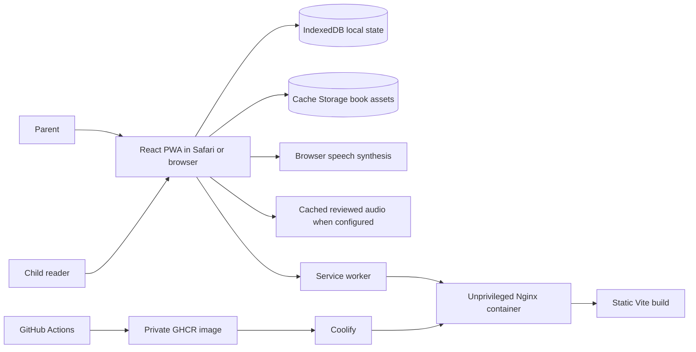
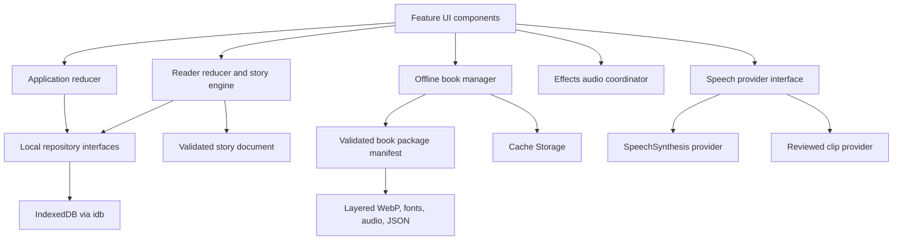
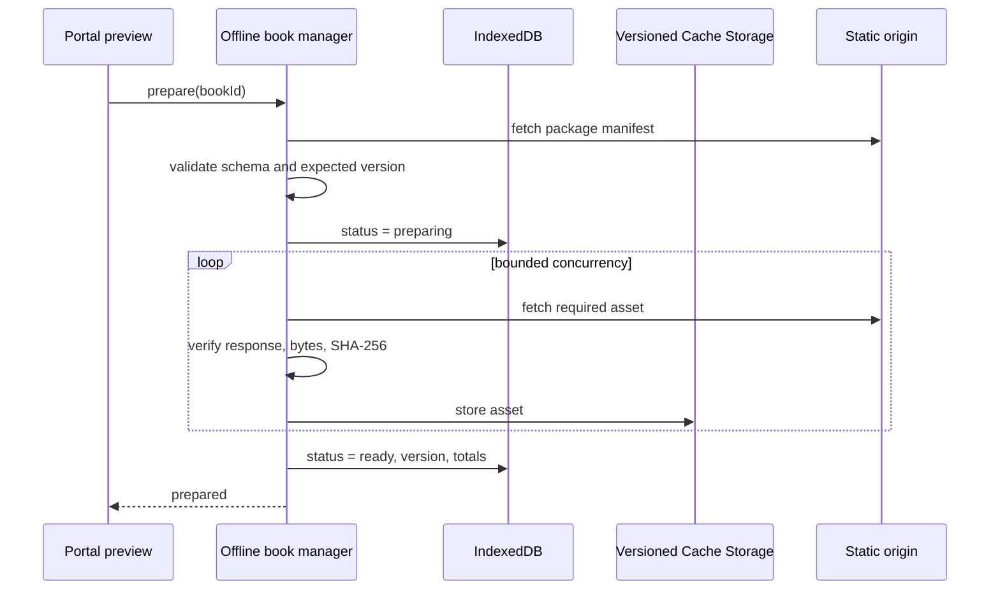

# Technical Design Document: Aby Little Book

**Status:** Draft 1  
**Product stage:** Private family prototype  
**Primary client:** Current family iPad, Safari, landscape  
**Secondary clients:** Phone portrait and desktop browsers  
**Deployment:** Coolify using immutable private GHCR images  
**Last updated:** 2026-08-11

---

## 1. Purpose

This document defines the implementation architecture for the first Aby Little Book prototype. It translates the approved product, story, UX, and art requirements into technical boundaries, data contracts, state transitions, offline behavior, performance budgets, test expectations, container design, and release procedure.

The design covers one complete bilingual book, *The Starlight Rescue*, while keeping story content declarative enough that another authored book could later use the same reader. It does not design the future AI authoring platform, family accounts, cloud sync, or a public content service.

The implementation must preserve the core product principle:

> A book brought gently to life—not a game with text added to it.

---

## 2. Authority and dependencies

This document depends on:

- `docs/PRD.md` for product scope and acceptance requirements
- `docs/STORY-SPEC.md` for narrative structure, localized prose, interactions, and story assets
- `docs/UX-SPEC.md` for application states, interaction behavior, layouts, and accessibility
- `docs/ART-BIBLE.md` for visual tokens, composition, motion, and production standards
- `docs/BLENDER-SPIKE-BRIEF.md` for the technical-art experiment
- `art/spikes/share-the-light/notes/SPIKE-RESULT.md` for measured pipeline evidence
- `art/spikes/share-the-light/manifest/asset-manifest.json` for the proven layered-asset shape

When documents disagree:

1. Child safety and privacy requirements take precedence.
2. The PRD controls product scope.
3. The Story Specification controls narrative meaning and branch structure.
4. The UX Specification controls observable interaction behavior.
5. The Art Bible controls visual production.
6. This TDD controls implementation mechanics.

Any implementation constraint that would change observable product behavior requires the governing document to be updated rather than silently changing the experience in code.

---

## 3. Scope

### 3.1 Included

- Bilingual English and Indonesian application shell
- Celestial bookshelf and one portal book
- Portal preview with three authored astronaut choices
- Ten-spread playthrough through one of two converging routes
- Layered WebP story scene rendering
- Optional scene discoveries and one required route choice
- Isolated tappable-word pronunciation
- Gentle local sound effects
- Local progress, settings, route history, and Lumi keepsake
- Explicit complete-book offline preparation
- Installable PWA
- Parent gate, settings, and destructive reset
- Responsive iPad spread and phone single-page layouts
- Desktop pointer and keyboard support
- Docker delivery through Coolify
- Pull-request CI and owner-approved semantic releases

### 3.2 Excluded

- Backend API
- Database server
- Accounts, authentication, or cloud synchronization
- Child profiles or child-supplied information
- Analytics, advertising, tracking, or remote error collection
- AI generation or editing in the running application
- Content management system
- Runtime Blender or live 3D
- Music, ambience, autoplay narration, or voice recording
- Multiple production books
- Social or sharing features

### 3.3 Deliberate architectural boundary

The prototype is a static web application. Nginx serves immutable files, but no application server executes business logic. All story behavior runs in the browser. IndexedDB stores structured local state; Cache Storage stores offline files.

Future server-side features must be introduced as a separate architectural phase. The prototype must not contain dormant API clients, authentication abstractions, database adapters, or synchronization machinery.

---

## 4. Architectural decisions

| Area | Decision | Rationale |
|---|---|---|
| Application | Vite + React + TypeScript | Small client-only build, direct PWA integration, and no unused server framework |
| Package manager | pnpm | Deterministic, strict, and efficient dependency installation |
| State | React reducers and context | Explicit transitions without a global-state dependency for one book |
| Story validation | Zod | Shared runtime and build-time validation for declarative content |
| Local structured storage | IndexedDB through `idb` | Typed asynchronous persistence without a large database abstraction |
| Offline bytes | Cache Storage | Appropriate store for images, fonts, audio, and story package files |
| PWA | `vite-plugin-pwa` in `injectManifest` mode | Workbox shell precaching plus custom explicit book-download behavior |
| Styling | Tailwind CSS v4 with CSS-first tokens | Implements the Art Bible through semantic design tokens |
| Motion | CSS transitions plus Motion for React where sequencing is meaningful | Keeps simple feedback light while supporting page and completion transitions |
| Accessibility | Native semantic HTML first; React Aria Components only for complex focus-managed controls | Preserves semantics without wrapping every child interaction in a component framework |
| Images | Layered WebP delivery; PNG retained outside production bundle | Proven browser compositing with practical transfer size |
| Speech | Pluggable browser-speech and reviewed-audio providers | Allows iPad testing to decide the accepted pronunciation source |
| Tests | Vitest, Testing Library, and Playwright | Covers pure story rules, accessible components, and browser journeys |
| Production server | Unprivileged Nginx | Small static runtime, non-root execution, caching control, and health checks |
| Delivery | Private GHCR image deployed to Coolify | One immutable artifact from CI through production and rollback |
| Telemetry | None | Private observation without collecting child behavior or device data |

### 4.1 Explicitly rejected for this phase

- Next.js or another server-capable framework
- Zustand or XState
- React Query or an API client
- Native IndexedDB calls spread across features
- Runtime JSON-authored executable scripts
- Canvas-first or WebGL story rendering
- A universal center crop for all device classes
- `latest` as the production release identifier

---

## 5. System context



No runtime request leaves the application origin except the browser's built-in speech implementation, whose operating-system behavior is outside the application network model. The application contains no third-party scripts, analytics beacons, remote fonts, or externally hosted media.

---

## 6. Runtime and build baseline

### 6.1 Runtime targets

- Current supported iPadOS Safari on the family iPad is the acceptance browser.
- Installed standalone PWA behavior must be tested on that iPad.
- Current Chromium and WebKit run in CI.
- Phone portrait and desktop are supported adaptations, not equal visual-approval targets.
- JavaScript is required; there is no server-rendered fallback.

### 6.2 Toolchain policy

- Pin Node.js 24 LTS for local development and CI.
- Pin pnpm through the `packageManager` field and Corepack.
- Commit `pnpm-lock.yaml`.
- Use strict TypeScript settings.
- Treat lint, type, content-schema, and test failures as CI failures.
- Do not use floating container tags for a production release; pin the selected base-image version and record the resulting image digest.

Exact library versions belong in the lockfile created during implementation. The TDD fixes major architectural choices rather than guessing every future patch version.

### 6.3 Production output

Vite emits a static `dist/` directory containing:

- `index.html`
- hashed JavaScript and CSS
- local fonts
- PWA manifest and icons
- service worker
- localized UI resources
- shelf-critical assets
- version and health files
- downloadable versioned book packages

PNG masters, Blender files, look tests, and production-review composites must not be copied into the runtime image.

---

## 7. Logical architecture



### 7.1 Layer responsibilities

**Feature UI** renders state and emits domain events. It does not write IndexedDB or Cache Storage directly.

**Reducers and story engine** enforce navigation, route, completion, and interaction rules as pure functions.

**Repository adapters** serialize and migrate local structured state.

**Offline book manager** owns package download, validation, readiness, and deletion.

**Speech and effects coordinators** own audio priority and cancellation.

**Service worker** serves the app shell and prepared book assets offline. It does not decide narrative state.

---

## 8. Proposed project organization

Use feature-first organization and avoid broad barrel files.

```text
/
├── public/
│   ├── app-icons/
│   ├── fonts/
│   ├── shelf/
│   ├── audio/effects/
│   ├── books/starlight-rescue/<content-version>/
│   │   ├── book.json
│   │   ├── package-manifest.json
│   │   ├── scenes/
│   │   └── audio/words/               # only when reviewed clips are selected
│   ├── healthz
│   └── version.json                    # generated during build
├── scripts/
│   ├── validate-content.ts
│   ├── validate-assets.ts
│   └── build-version.ts
├── src/
│   ├── app/
│   │   ├── App.tsx
│   │   ├── AppProvider.tsx
│   │   ├── app.reducer.ts
│   │   └── bootstrap.ts
│   ├── features/
│   │   ├── language-choice/
│   │   ├── bookshelf/
│   │   ├── book-preview/
│   │   ├── reader/
│   │   │   ├── reader.reducer.ts
│   │   │   ├── story-engine.ts
│   │   │   ├── SceneLayers.tsx
│   │   │   ├── StoryText.tsx
│   │   │   ├── WordButton.tsx
│   │   │   ├── PageNavigation.tsx
│   │   │   └── interactions/
│   │   ├── parent-controls/
│   │   ├── offline-book/
│   │   └── completion/
│   ├── content/
│   │   ├── schemas/
│   │   ├── localization/
│   │   └── catalog.ts
│   ├── services/
│   │   ├── storage/
│   │   ├── offline/
│   │   ├── speech/
│   │   └── audio/
│   ├── shared/
│   │   ├── ui/
│   │   ├── hooks/
│   │   ├── errors/
│   │   └── types/
│   ├── styles/
│   │   ├── app.css
│   │   ├── tokens.css
│   │   └── motion.css
│   ├── sw.ts
│   └── main.tsx
├── tests/
│   ├── fixtures/
│   └── e2e/
├── nginx/
│   └── default.conf
├── Dockerfile
└── package.json
```

Keep tests beside pure modules and components where practical. Reserve `tests/e2e/` for full browser journeys and cross-feature fixtures.

---

## 9. Content model

### 9.1 Principles

- Story content is data, not React code.
- Story data cannot contain JavaScript, HTML, CSS, or arbitrary action expressions.
- IDs are stable English machine identifiers.
- Displayed copy is localized.
- Progress refers to stable IDs rather than array positions.
- Both routes, all three astronaut variants, and both languages belong to one versioned book package.
- All content is adult-reviewed before the package is published.

### 9.2 Core types

The implementation should express the following contracts as Zod schemas with inferred TypeScript types:

```ts
type Locale = 'en' | 'id'
type AstronautId = 'aby' | 'maya' | 'niko'
type RouteId = 'asteroid-garden' | 'singing-starfield'
type LayoutClass = 'ipad-spread' | 'phone-page'

interface BookDocument {
  schemaVersion: number
  bookId: 'starlight-rescue'
  contentVersion: string
  title: LocalizedText
  entrySpreadId: string
  completionSpreadId: string
  astronauts: AstronautDefinition[]
  routes: RouteDefinition[]
  spreads: SpreadDefinition[]
  pronunciationOverrides: PronunciationOverride[]
}

interface SpreadDefinition {
  id: string
  ordinal: number
  route: RouteId | 'shared'
  localizedText: LocalizedTemplate
  sceneDescription: LocalizedText
  layouts: Record<LayoutClass, SceneLayout>
  interaction: InteractionDefinition | null
  next: StoryTransition
}
```

`contentVersion` is an immutable semantic content version. A change to prose, branch behavior, required assets, target bounds, or pronunciation mapping increments it.

### 9.3 Astronaut grammar

```ts
interface AstronautDefinition {
  id: AstronautId
  name: string
  englishGrammar: {
    subject: string
    subjectCap: string
    object: string
    possessive: string
  }
  visualAccent: 'coral' | 'teal' | 'sunflower'
  layerKey: string
}
```

Template resolution happens before text is tokenized into word controls or sent to a speech provider. Indonesian templates should use authored natural phrasing rather than mechanically applying English pronouns.

Allowed tokens are fixed to `{name}`, `{subject}`, `{subject_cap}`, `{object}`, and `{possessive}`. Build validation rejects unknown or unresolved tokens.

### 9.4 Route graph

The build validator must prove:

- One entry spread exists.
- Spread IDs are unique.
- All transitions reference existing spreads.
- The only branch occurs at Spread 03.
- Both branch options are reachable.
- Route A uses Spreads 04A–06A.
- Route B uses Spreads 04B–06B.
- Both routes converge at Spread 07.
- Each completed path contains exactly ten spreads.
- The completion spread is reachable from both routes.
- No unintended cycles exist.
- Only the route-choice interaction blocks forward navigation.

The runtime engine does not infer branches from ordinal numbers. It follows validated stable IDs and transition definitions.

### 9.5 Approved interaction catalog

The schema supports only reviewed interaction kinds:

```ts
type InteractionKind =
  | 'find-and-tap'
  | 'reveal'
  | 'chain-reveal'
  | 'character-response'
  | 'route-choice'
```

Each definition contains an ID, localized accessible name, target bounds by layout, response asset IDs, effect sound ID, hint treatment, duration, and reduced-motion response. Interaction definitions cannot reference executable scripts.

### 9.6 Localized text and word tokens

Use `Intl.Segmenter` with word granularity when supported, backed by a deterministic tested tokenizer for the two approved locales. The result must preserve punctuation and whitespace visually while wrapping only speakable words in semantic buttons.

Each word token contains:

- stable occurrence key
- displayed text
- punctuation-stripped spoken value
- locale
- optional pronunciation key
- speakable boolean

Do not use `dangerouslySetInnerHTML` for story prose.

---

## 10. Asset package model

### 10.1 Separation from the Blender production manifest

The Blender export manifest is production evidence. A build script transforms approved records into a smaller runtime package manifest. The runtime manifest must not expose local source paths or ship PNG master references.

### 10.2 Runtime package manifest

```ts
interface BookPackageManifest {
  schemaVersion: number
  bookId: string
  contentVersion: string
  generatedAt: string
  totalBytes: number
  storyUrl: string
  assets: PackageAsset[]
}

interface PackageAsset {
  id: string
  url: string
  bytes: number
  sha256: string
  mediaType: string
  required: true
  role: 'story' | 'image' | 'font' | 'effect-audio' | 'word-audio'
}
```

All URLs are same-origin and versioned. The manifest includes both routes, both layouts, all astronaut variants, localization, required effects, and—if selected—reviewed word audio. This guarantees that changing astronaut, language, or route does not require a network connection after preparation.

### 10.3 Scene layout and layers

```ts
interface SceneLayout {
  canvas: { width: number; height: number }
  textSafeBounds: Bounds
  characterSafeBounds?: Bounds
  centerFoldX?: number
  layers: SceneLayer[]
}

interface SceneLayer {
  id: string
  urlByAstronaut?: Partial<Record<AstronautId, string>>
  url?: string
  order: number
  state: 'rest' | 'response'
  decorative: boolean
  blendMode?: 'normal' | 'screen'
}
```

Every layer in one layout uses a registered full canvas. The renderer sorts numerically by `order`, not by JSON declaration order. Interactive HTML hit regions are separate from decorative images.

Reference composites are test artifacts and are excluded from the downloaded runtime package unless a deliberate diagnostic build enables them.

---

## 11. Application state model

### 11.1 Application views

```ts
type AppView =
  | 'language-choice'
  | 'bookshelf'
  | 'book-preview'
  | 'reader'
  | 'rotate-request'
  | 'parent-gate'
  | 'parent-controls'
```

The prototype does not require a routing library. A top-level reducer controls these finite views. Browser deep links are not a product requirement. Returning from the reader uses the authored shelf bookmark rather than browser history.

### 11.2 Durable state

```ts
interface DeviceSettings {
  locale: Locale | null
  selectedAstronautId: AstronautId | null
  pronunciationEnabled: boolean
  effectsEnabled: boolean
  seenHints: string[]
}

interface BookProgress {
  bookId: string
  contentVersion: string
  status: 'new' | 'in-progress' | 'completed'
  stableSpreadId: string | null
  activeRoute: RouteId | null
  completedRoutes: RouteId[]
  completedAt: string | null
  updatedAt: string
}
```

Lumi's shelf presence is derived from `status === 'completed'` or a non-empty `completedRoutes`; it does not need a second contradictory reward flag.

Language and astronaut selection remain device settings, independent of narrative progress. Changing either must not reset `stableSpreadId`, `activeRoute`, or `completedRoutes`.

### 11.3 Ephemeral reader state

The reader reducer owns:

- current displayed spread
- transition phase
- active word occurrence
- active interaction response
- hint timer eligibility
- hold progress
- gesture ownership
- current layout class
- whether completion close is available

Ephemeral animation state is never persisted.

### 11.4 Reader events

Representative events include:

```ts
type ReaderEvent =
  | { type: 'OPEN'; progress: BookProgress }
  | { type: 'NEXT_REQUESTED' }
  | { type: 'PREVIOUS_REQUESTED' }
  | { type: 'TRANSITION_FINISHED' }
  | { type: 'ROUTE_SELECTED'; route: RouteId }
  | { type: 'WORD_SELECTED'; occurrenceId: string }
  | { type: 'WORD_FINISHED'; occurrenceId: string }
  | { type: 'INTERACTION_ACTIVATED'; interactionId: string }
  | { type: 'INTERACTION_FINISHED'; interactionId: string }
  | { type: 'CLOSE_BOOK' }
  | { type: 'LAYOUT_CHANGED'; layout: LayoutClass }
```

Invalid events are ignored by the reducer rather than producing partial transitions. Tests must cover route lock, repeated navigation, simultaneous speech, and completion boundaries.

### 11.5 Stable save points

Persist progress only when the destination spread has committed, after route selection, at explicit completion, and when settings change. Do not persist an in-flight page animation as the current location.

The save operation is asynchronous and must not block visual feedback. A failed write retains state in memory and exposes a parent-facing diagnostic; it must not show a technical message to the child during reading.

---

## 12. Navigation and branching mechanics

### 12.1 Navigation rules

- Next is disabled during transitions.
- Previous is disabled on Spread 01.
- Next is disabled at Spread 03 until a route is selected.
- Returning to Spread 03 never re-enables the unselected route in the same playthrough.
- Previous navigation is limited to spreads visited in the active path.
- Spread 10 replaces Next with Close the Book.
- Starting Read Again resets active route and stable spread, but preserves completed-route history and the Lumi keepsake.

### 12.2 Gesture thresholds

Initial values for physical-device tuning:

- Capture a swipe only after at least 48 CSS pixels of horizontal travel.
- Require horizontal travel to exceed vertical travel by a ratio of at least 1.35.
- Ignore gestures shorter than the threshold.
- A gesture originating from a word, scene target, route choice, shelf bookmark, or parent control belongs to that control.
- Use Pointer Events and pointer capture; do not implement separate touch and mouse engines.
- Apply `touch-action: pan-y` to general scene surfaces and explicit control behavior to owned targets.

These are test starting points, not immutable UX values. Changes after iPad observation must be recorded in the UX Specification.

### 12.3 Transition timing

- Normal page transition target: 350–500 ms.
- Ignore repeated navigation until commit.
- Start preloading adjacent spreads before a transition is requested.
- Reduced motion uses a 100–180 ms crossfade or immediate swap.
- Cancel active pronunciation and hints when navigation commits.

---

## 13. Scene rendering

### 13.1 DOM composition

Render each scene as a fixed-aspect-ratio relative container:

1. Decorative image layers
2. Response image layers
3. HTML scene interaction targets
4. Paper story panel and semantic word controls
5. Navigation, progress, and protected-exit controls

Layers use absolutely positioned `` elements filling the authored canvas. Decorative images use empty alternative text. One localized scene description is associated with the active spread for assistive technology.

Do not use `<canvas>` for prose, controls, hit testing, or general composition.

### 13.2 Loading and decode

- Load only the active layout's layers.
- Decode the destination spread with `HTMLImageElement.decode()` before committing navigation where supported.
- Preload the next and previous possible spreads during idle time.
- Keep at most the previous, active, and next spread decoded.
- Do not mount both iPad and phone full-resolution layer sets and hide one with CSS.
- Reserve aspect ratio before images resolve to prevent layout shift.

### 13.3 Interaction feedback

Response layers may use approved `screen` blending. A small CSS radial bloom may supplement the lamp response because the Blender spike proved that rendered response layers alone become too subtle after browser downscaling.

CSS enhancement must remain bound to the authored target, preserve the reduced-motion equivalent, and not hide unclear base staging.

### 13.4 Layout classification

Use CSS media queries for presentation and `matchMedia` subscriptions for behavior. Do not use user-agent strings.

Initial classes:

- `ipad-spread`: landscape and viewport width at least 900 CSS pixels
- `phone-page`: viewport width below 768 CSS pixels
- `rotate-request`: portrait with viewport width at least 768 CSS pixels while reader is active
- Intermediate widths use the safer single-page layout until validated

Safe-area environment variables must protect controls in installed mode. Exact breakpoints require physical iPad and representative phone verification before final acceptance.

---

## 14. Story text and pronunciation

### 14.1 Word controls

- Render each speakable word as a native `<button type="button">` within natural inline text.
- Preserve punctuation as adjacent text or as a non-spoken part of the visual token.
- Use a minimum forgiving internal target without producing broken word spacing.
- Prevent event propagation from a word into scene and navigation layers.
- Maintain one active highlighted word.
- Tapping a new word cancels the previous utterance before starting another.
- A disabled pronunciation setting preserves visual highlight feedback.

### 14.2 Provider interface

```ts
interface SpeechProvider {
  readonly kind: 'browser' | 'recorded'
  prepare(locale: Locale): Promise<SpeechReadiness>
  speak(request: SpeakWordRequest): Promise<void>
  cancel(): void
  dispose(): void
}
```

`SpeakWordRequest` includes displayed word, normalized spoken value, locale, optional pronunciation key, and cancellation signal.

### 14.3 Browser speech provider

- Map English to an approved `en-*` voice and Indonesian to an approved `id-ID` voice.
- Handle asynchronous `voiceschanged` population.
- Set deliberate rate, pitch, and volume only after target-device review.
- Cancel before every new utterance and on navigation.
- Never speak full prose automatically.
- Do not claim offline readiness from API presence alone; physical iPad validation is mandatory.

### 14.4 Reviewed audio provider

If browser speech fails quality or offline acceptance:

- Use reviewed, locally cached clips keyed by locale and pronunciation key.
- Deduplicate repeated words across spreads.
- Include proper-name overrides without changing displayed spelling.
- Include every required clip in the book package manifest.
- Decode clips on demand and keep a small audio cache.
- Preserve the same provider interface and visual behavior.

The accepted provider is a release-level configuration, not an automatic child-facing fallback that changes voices unpredictably during a session.

---

## 15. Effects audio coordination

Use one `AudioCoordinator` for all brief effects.

Priority order:

1. Word pronunciation
2. Required route confirmation
3. Direct scene response
4. Page and completion effects
5. Hints, which are visual-only by default

When pronunciation starts, stop or duck active effects and prevent new lower-priority effects until the word finishes. Muting effects must not mute word pronunciation; the parent controls are separate settings.

Audio files are same-origin, reviewed, compressed, and included in the offline package. Browser autoplay restrictions are satisfied because all audio begins after a user gesture; no workaround or silent autoplay loop is permitted.

---

## 16. Local persistence

### 16.1 IndexedDB database

Database name: `aby-little-book`  
Initial version: `1`

Object stores:

| Store | Key | Contents |
|---|---|---|
| `settings` | `device` | Locale, astronaut, sound settings, seen hints |
| `progress` | `bookId` | Stable spread, active route, completed routes, status |
| `offlineBooks` | `bookId` | Content version, package state, byte totals, timestamps |

No store contains a child name, birth date, image, voice, behavioral event history, or external identifier.

### 16.2 Repository boundary

```ts
interface LocalLibraryRepository {
  loadSettings(): Promise<DeviceSettings>
  saveSettings(settings: DeviceSettings): Promise<void>
  loadProgress(bookId: string): Promise<BookProgress | null>
  saveProgress(progress: BookProgress): Promise<void>
  loadOfflineBook(bookId: string): Promise<OfflineBookRecord | null>
  saveOfflineBook(record: OfflineBookRecord): Promise<void>
  resetStoryData(bookId: string): Promise<void>
}
```

Only repository implementations import `idb`. Feature code depends on this interface.

### 16.3 Migration and invalid data

- Upgrade IndexedDB through explicit version migrations.
- Validate loaded records before use.
- Preserve device settings when only story progress is incompatible.
- If progress refers to a removed spread or route, stop at the preview and offer an adult-readable reset path; do not invent a destination.
- Parent reset deletes progress, route history, keepsake derivation, astronaut selection, and seen story hints as specified by UX. Locale and sound settings remain unless a later explicit full reset is added.

### 16.4 Storage persistence

After an explicit book download gesture, request persistent browser storage when supported. Failure to receive persistent status must not be treated as book-download failure because Safari support and eviction policy vary. The preview may show a parent-facing warning only when storage estimation indicates the complete package cannot fit.

---

## 17. Offline and PWA architecture

### 17.1 Service-worker strategy

Use `vite-plugin-pwa` in `injectManifest` mode with a project-owned `src/sw.ts`.

The service worker:

- precaches the minimal application shell and shelf-critical assets
- serves hashed shell assets cache-first
- handles navigation with an offline-capable app-shell fallback
- serves prepared book package files cache-first
- does not precache all story art during installation
- cleans obsolete application-shell caches after activation
- waits to activate an update while the reader is open

### 17.2 Explicit book preparation

The portal preview exposes a localized **Download Book** action before first reading.



### 17.3 Atomic readiness rule

Use a versioned cache name such as `book:starlight-rescue:<contentVersion>`. Cache Storage has no rename transaction, so readiness is represented in IndexedDB.

- `preparing` caches are never considered complete.
- Mark `ready` only after every required file passes validation.
- On failure, retain the previous ready version, delete the incomplete new cache, and offer retry.
- On startup, remove abandoned `preparing` caches.
- Delete an old ready version only after the new version is fully ready and no active reader uses it.

### 17.4 Download behavior

- Fetch with bounded concurrency of four assets initially.
- Compute progress by downloaded bytes when content length is available; fall back to completed asset weight internally.
- Present calm determinate progress without technical file counts.
- Allow cancellation before completion and delete the incomplete cache.
- Do not open the book until story data and all required assets are ready.
- A network loss after readiness must not affect either route, language, astronaut, pronunciation source, effects, or completion.

### 17.5 App updates

- Detect a waiting service worker.
- Do not refresh or activate it during a reading session.
- Apply it on a shelf or launch boundary after saving stable state.
- If a new application expects a new book content version, preserve old progress until migration and new package readiness are known.
- Never strand the reader between incompatible shell and book versions.

### 17.6 PWA manifest

The manifest defines:

- localized-neutral application name and short name
- standalone display
- portrait-capable shell but landscape-preferred reading
- theme and background colors from the Art Bible
- maskable and standard locally stored icons
- no shortcuts that bypass language, preparation, or preview requirements

---

## 18. Parent gate and protected controls

### 18.1 Hold mechanics

Use Pointer Events with a visible progress indicator. Initial tuning values:

- Reader shelf exit hold: 700 ms
- Parent gate hold: 1,200 ms
- Cancel when pointer is released, canceled, or moves materially outside the target
- Reduced motion uses a static fill progression rather than travel animation

These values require target-iPad observation.

### 18.2 Adult reading prompt

After the parent hold, select a prompt from a reviewed localized set and randomize symbol positions. Use shape plus color. The prompt is a lightweight deterrent, not authentication, and must not be described as a security boundary.

### 18.3 Reset transaction

The reset command:

1. Requires explicit confirmation.
2. Closes active speech and effects.
3. Deletes story progress and route history in one IndexedDB transaction.
4. Clears derived Lumi presence and first-use story hints.
5. Retains locale and sound settings.
6. Returns to the new-book shelf state.

Offline book bytes remain prepared; resetting narrative progress does not redownload the book.

---

## 19. Localization architecture

### 19.1 Resource separation

- Application UI strings live in locale resources under `src/content/localization/`.
- Story prose lives in the versioned book document.
- Accessible names, recovery text, parent prompts, and status copy are localized.
- Art contains no language-dependent text.

### 19.2 Locale behavior

- Supported locales are exactly `en` and `id` for the prototype.
- One locale is active at a time.
- Language choice is stored once at device level.
- Locale changes update the shelf, preview, prose, controls, accessible labels, and speech provider without changing narrative progress.
- Both locales retain left-to-right reading and navigation.
- Names Aby, Maya, Niko, and Lumi remain unchanged.

### 19.3 Validation

Build validation fails on:

- missing keys in either locale
- empty child-facing strings
- unresolved story tokens
- untranslated placeholders
- unknown locale codes
- route choices with unequal localization coverage
- interaction targets without localized accessible names

Fluent-adult review remains a human release gate; automated parity does not prove translation quality.

---

## 20. Styling and design tokens

### 20.1 Tailwind v4 strategy

- Import Tailwind through CSS.
- Define Art Bible brand values as CSS custom properties and expose semantic values through `@theme`.
- Prefer semantic names such as `paper`, `ink`, `focus`, `guidance`, `shelf`, and `route-a` over raw palette names in feature components.
- Keep scene-specific positions in validated content bounds, not utility-class strings embedded in JSON.
- Use small authored component CSS for the physical book, fold, text panel, layer compositor, and complex motion.

### 20.2 Typography

- Bundle license-approved Literata and Nunito WOFF2 subsets locally.
- Preload only weights used above the fold.
- Story prose begins in the 28–36 CSS pixel iPad range with line-height 1.4–1.55.
- Indonesian must fit without scrolling or dropping below the approved physical-device minimum.
- Font loading must not cause a panel-size shift; use compatible fallback metrics or wait before revealing the first story panel.

### 20.3 Motion

- Use CSS for pressed states, word highlighting, target hints, and simple fades.
- Use Motion for React only for coordinated portal, page, and ending-to-shelf transitions.
- Lazy-load transition code that is not needed for the initial shelf.
- Read reduced-motion preference through a shared hook and make it authoritative for all features.
- Do not create continuous animation loops in the reader.

---

## 21. Accessibility implementation

### 21.1 Semantic controls

- Books, words, route choices, scene targets, tabs, and parent controls are buttons.
- Route selection exposes selected and unavailable states through ARIA and visible treatment.
- Progress ribbon exposes “Spread n of 10” without presenting a child-facing score.
- Decorative layer images use `alt=""`.
- Each spread exposes one concise localized scene description.
- Focus order follows the visible reading order.

### 21.2 Target sizing

- Child-facing controls aim for at least 56 × 56 CSS pixels.
- Hit areas may exceed visible art bounds but must not overlap words or navigation regions.
- Desktop controls support Enter and Space; reader supports Left and Right Arrow.
- Hover is never required.

### 21.3 Focus and announcements

- Use visible focus rings from the Art Bible.
- Do not move focus when a decorative response finishes.
- After a committed page change, move the assistive reading context to the spread heading or scene container without disrupting touch use.
- Parent dialogs use focus trapping and return focus to their launcher; React Aria Components may be used here.
- Avoid live-region announcements for every decorative animation.

### 21.4 Contrast and non-color states

- Test story and control text to WCAG AA against their fixed surfaces.
- Use shape, label, position, or outline in addition to color.
- Motion and sound are never the sole source of story meaning.

---

## 22. Error handling and recovery

### 22.1 Error taxonomy

```ts
type AppErrorCode =
  | 'CONTENT_INVALID'
  | 'ASSET_MANIFEST_INVALID'
  | 'BOOK_DOWNLOAD_FAILED'
  | 'BOOK_INCOMPLETE'
  | 'STORAGE_WRITE_FAILED'
  | 'STORAGE_QUOTA_INSUFFICIENT'
  | 'SPEECH_UNAVAILABLE'
  | 'ASSET_DECODE_FAILED'
```

Use typed errors at service boundaries. Child-facing UI never displays stack traces, URLs, cache names, or raw browser errors.

### 22.2 Recovery behavior

| Failure | Behavior |
|---|---|
| Package download fails | Preserve previous ready version, show localized retry on preview |
| Required active asset fails | Stop before incomplete spread, preserve progress, offer retry or preview |
| IndexedDB write fails | Keep in-memory session, show parent-facing diagnostic at safe boundary |
| Speech unavailable in development | Keep visual word feedback; flag parent diagnostic; fail release gate |
| Content schema fails | Do not open book; fail build or show adult-readable unavailable state |
| Storage estimate insufficient | Do not begin download; provide calm adult-facing space message |
| Service-worker update arrives in reader | Defer until shelf or next launch |

### 22.3 Local diagnostics

No remote telemetry is sent. A development-only diagnostics panel may show:

- application and content version
- service-worker state
- selected speech provider and voices
- offline package status and bytes
- current layout class
- asset-load failure details

It must be excluded from production child navigation and must not persist a behavioral event log.

---

## 23. Privacy and security

### 23.1 Data minimization

The application stores only:

- interface language
- selected authored astronaut ID
- sound settings
- seen guidance flags
- reading position and active route
- completed route IDs and derived Lumi presence
- offline package metadata

It does not request or store a child's real name, age, appearance, image, voice, free text, contact information, or account identifier.

### 23.2 Network and dependencies

- No analytics or tracking SDKs
- No third-party fonts or media requests
- No social embeds
- No advertising
- No runtime AI services
- No source maps exposed by the production container unless deliberately enabled for a private diagnostic build
- Dependency review and container scanning occur in CI

### 23.3 Website access boundary

The user selected an HTTPS **unlisted URL** without website authentication for the private prototype. This is obscurity, not an access-control guarantee. The documentation and deployment must describe it accurately.

- Coolify terminates HTTPS.
- Search indexing is discouraged through `robots.txt` and `X-Robots-Tag: noindex, nofollow, noarchive`.
- The URL must not be published in repository files, screenshots, or release notes.
- The parent gate does not protect the site itself.
- Any public or wider-family release requires a new access and privacy decision.

### 23.4 HTTP headers

Nginx should set at least:

- `Content-Security-Policy` restricted to same-origin application resources, with only the minimum inline-style allowance required by authored positioning
- `X-Content-Type-Options: nosniff`
- `Referrer-Policy: no-referrer`
- `Permissions-Policy` disabling unused sensors and capabilities
- `X-Frame-Options: DENY` or equivalent CSP `frame-ancestors 'none'`
- `X-Robots-Tag: noindex, nofollow, noarchive`

Do not enable cross-origin isolation without a demonstrated requirement.

---

## 24. Performance budgets

Budgets are provisional and use the successful Blender spike as evidence. They must be measured on the family iPad before acceptance.

### 24.1 Transfer budgets

| Resource | Budget |
|---|---:|
| Initial JavaScript, gzip | ≤ 200 KiB |
| Initial CSS, gzip | ≤ 60 KiB |
| Initial local font transfer | ≤ 300 KiB |
| Shelf-critical first load excluding book package | ≤ 1.5 MiB |
| One active spread's delivery layers for one layout | Target ≤ 750 KiB |
| Complete book without recorded word clips | Target ≤ 20 MiB |
| Complete book with recorded word clips | Target ≤ 35 MiB |

The spike's 22 iPad/phone PNG assets totaled 28,254,530 bytes; WebP equivalents totaled 817,516 bytes. The 97.1% reduction is encouraging but must not be assumed for every scene.

PNG masters and flattened reference composites are excluded from transfer budgets because they are not runtime assets.

### 24.2 Interaction budgets

| Measure | Target |
|---|---:|
| Press feedback begins | ≤ 100 ms |
| Prepared adjacent spread commits after navigation request | ≤ 500 ms including normal page transition |
| Word highlight begins | ≤ 100 ms |
| Route selection visual acknowledgement | ≤ 100 ms |
| Stable progress save | asynchronous; must not delay transition |

### 24.3 Rendering and memory

- No visible layout shift inside the reader after it appears.
- Keep only previous, active, and next spread decoded.
- Do not retain both responsive layer families in memory.
- Avoid React rerenders caused by hint animation ticks; use CSS or refs for transient progress.
- Subscribe components to the smallest reducer context needed.
- Direct-import feature modules rather than broad barrels.
- Measure image decode and memory pressure on physical Safari, where full-canvas transparent layers can be more expensive than transfer size suggests.

### 24.4 Core browser measures

For the online first visit on the family connection, aim for:

- LCP ≤ 2.5 seconds for the shelf
- CLS ≤ 0.1 for the shell and effectively zero during reading
- no long task above 200 ms during page navigation on the target iPad

These are engineering budgets, not analytics events; measure them manually and in controlled tests.

---

## 25. Testing strategy

### 25.1 Test pyramid

**Vitest unit tests** cover:

- route graph traversal and convergence
- reducer transitions and invalid events
- replay semantics and route history
- token resolution and bilingual word segmentation
- Zod schemas and negative content fixtures
- persistence migrations
- offline readiness rules
- speech and effects priority
- layout classification

**Testing Library component tests** cover:

- semantic word buttons and punctuation
- route selected/locked states
- parent prompt and reset confirmation
- focus behavior
- reduced-motion equivalents
- localized loading and recovery states

**Playwright browser tests** cover:

- first launch through book preparation and opening
- selecting each astronaut without changing narrative progress
- both routes reaching the same ending
- route lock when navigating backward
- save, reload, and Continue
- close-book completion and Lumi shelf presence
- Read Again and alternate-route discovery
- English/Indonesian switching
- word cancellation and non-overlap using a deterministic test provider
- interaction versus swipe ownership
- offline completion after preparation
- parent gate and reset
- phone layout and desktop keyboard behavior
- reduced-motion mode
- all scene layers loading and aligning

### 25.2 Browser matrix

Every pull request runs Playwright on:

- Chromium
- WebKit

Automated WebKit is useful but does not replace physical iPad Safari. The release checklist retains a manual target-device gate.

### 25.3 Visual verification

- Capture deterministic rest and response screenshots for every approved scene and layout.
- Disable nondeterministic hints and transitions in baseline mode.
- Compare layer alignment, alpha seams, safe-region fit, target bounds, and English/Indonesian panel fit.
- Keep a small set of meaningful baselines; do not snapshot every decorative DOM node.
- Review intentional visual changes rather than blindly updating baselines.

### 25.4 Offline tests

Tests must prove:

1. An incomplete download is not marked ready.
2. A failed new version preserves a previous ready version.
3. Both routes and all three astronauts render offline.
4. Both locales remain available offline.
5. The selected pronunciation provider works offline.
6. Reloading the installed application restores progress.
7. A waiting service worker does not refresh an active reader.

### 25.5 Physical-device release tests

Before family acceptance, test on the target iPad:

- Safari browser and installed PWA
- touch, swipe, holds, and edge targets
- landscape reader and portrait rotate request
- English and Indonesian pronunciation online and offline
- image decode, page transitions, and memory over a full story
- local progress after application termination
- prepared-book behavior after network disconnection
- font readability and panel fit
- reduced motion
- child observation and parent gate

---

## 26. Build-time validation gates

The production build depends on these commands succeeding:

1. TypeScript type check
2. ESLint
3. formatting check
4. UI locale parity validation
5. story schema validation
6. route graph validation
7. asset-manifest reference and hash validation
8. Vitest unit and component tests
9. Vite production build
10. Playwright Chromium and WebKit tests in CI
11. Docker image build
12. container vulnerability scan at the agreed severity gate

Content validation must run before expensive browser tests so structural failures stop early.

---

## 27. Container design

### 27.1 Multi-stage image

The Dockerfile uses:

1. A pinned Node 24 Alpine builder
2. Corepack and frozen pnpm install
3. Validation, tests appropriate to the image stage, and Vite build
4. A pinned `nginxinc/nginx-unprivileged` Alpine runtime
5. Only `dist/` and reviewed Nginx configuration copied to runtime

The runtime:

- runs as non-root
- listens on port `8080`
- has a read-only application filesystem where Coolify permits
- requires no application secrets or writable volume
- exposes `/healthz` as a static liveness endpoint
- exposes `/version.json` with public version, commit, and build time

### 27.2 Nginx behavior

- SPA navigation falls back to `index.html`.
- Hashed assets use long immutable caching.
- `index.html`, service worker, web manifest, package manifests, and `version.json` use revalidation or no-cache policies appropriate to updates.
- Versioned story assets may use long immutable caching.
- Correct MIME types are set for WebP, JSON, WOFF2, Web App Manifest, JavaScript, and audio.
- Compression is enabled for text resources; already compressed images and audio are not recompressed unnecessarily.
- Security and no-index headers are applied consistently.

### 27.3 Health and readiness

The container health check requests `http://127.0.0.1:8080/healthz`. Post-deployment verification separately checks:

- `/healthz` returns 200
- `/version.json` reports the released tag and commit
- `/` serves the application shell
- one versioned book package manifest is reachable

A static health file proves the web server is alive, not that every PWA feature works. Browser smoke tests remain separate.

---

## 28. Continuous integration

### 28.1 Pull-request workflow

GitHub Actions workflow `ci.yml` runs for pull requests and protected-main updates:

1. Checkout with minimal permissions.
2. Set up pinned Node and pnpm with dependency caching.
3. `pnpm install --frozen-lockfile`.
4. Run format, lint, type, localization, story, and asset validation.
5. Run Vitest and Testing Library tests.
6. Build the production bundle.
7. Install pinned Playwright Chromium and WebKit dependencies.
8. Run browser tests in parallel jobs.
9. Build the Docker image without publishing it.
10. Scan application dependencies and the built image.

CI uses least-privilege workflow permissions. Pull-request code does not receive Coolify credentials or production deployment secrets.

### 28.2 Main branch policy

- Require pull requests.
- Require all CI checks.
- Prevent direct force pushes.
- Require resolved review conversations where collaborators exist.
- The repository owner controls production release approval.

The repository and GHCR package remain private.

---

## 29. Release and deployment pipeline

### 29.1 Release trigger

Production releases use semantic tags in the `v0.x.y` range. Merging to `main` does not deploy automatically.

The owner:

1. Confirms `main` CI is green.
2. Completes the release checklist, including required physical-iPad gates.
3. Creates a curated GitHub Release and matching signed or protected tag such as `v0.1.0`.
4. Approves the protected GitHub production environment.

### 29.2 Release workflow

The release workflow:

1. Verifies the tag points to an allowed `main` commit.
2. Re-runs deterministic validation and tests.
3. Builds the container once with OCI labels.
4. Tags the image with semantic version and commit SHA.
5. Publishes it to private GHCR.
6. Produces image digest, provenance, and SBOM where supported.
7. Scans the exact published image.
8. Updates the Coolify resource to the exact semantic tag or digest.
9. Triggers Coolify deployment through a protected API token or deploy hook.
10. Waits for health and verifies `/version.json`.
11. Records the deployed image digest in the GitHub Release.

Production must never deploy an ambiguous `latest` tag. A convenience moving tag may exist for humans, but Coolify must reference an immutable semantic version or digest.

### 29.3 Coolify configuration

- Configure a Docker-image application using private GHCR credentials with `read:packages` only.
- Terminate HTTPS at Coolify's proxy.
- Keep the production URL in a protected GitHub environment variable or secret, not repository documentation.
- Store the Coolify API token or deployment hook only in the protected production environment.
- Expose container port 8080.
- Configure the container health check.
- Retain enough previous immutable images for rollback.
- Disable source builds in production; deploy the CI-built image.

Exact Coolify API endpoints must be confirmed against the installed Coolify version during implementation. The invariant is that CI selects and deploys an exact immutable image, not that it relies on one undocumented endpoint shape.

### 29.4 Curated GitHub Release content

Each release records:

- child-facing or parent-facing summary
- notable technical changes
- content or asset-version changes
- physical-device validation status
- known issues and pending gates
- container image tag and digest
- rollback target

Do not include the unlisted production URL.

### 29.5 Rollback

Rollback redeploys the previous known-good immutable image; it does not rebuild old source.

1. Select the prior image tag and verify its recorded digest.
2. Update the Coolify resource to that exact image.
3. Trigger deployment.
4. Verify health and version endpoints.
5. Smoke-test shelf, prepared-book compatibility, and Continue.
6. Record the rollback in the affected GitHub Release.

Because progress and book caches live on the device, schema migrations must be backward-aware. A release that irreversibly upgrades local data requires an explicit compatibility and rollback plan before deployment.

---

## 30. Release checklist

### 30.1 Automated

- [ ] Format, lint, and type checks pass
- [ ] Story and UI localization parity passes
- [ ] Route graph and interaction schemas pass
- [ ] Asset files, hashes, dimensions, and manifests pass
- [ ] Unit and component tests pass
- [ ] Chromium and WebKit journeys pass
- [ ] Offline browser test passes
- [ ] Production build succeeds
- [ ] Docker image builds and runs unprivileged
- [ ] Container scan meets the release severity policy
- [ ] Health and version checks pass after deployment

### 30.2 Human content and visual review

- [ ] English story and application copy reviewed
- [ ] Indonesian story and application copy reviewed by a fluent adult
- [ ] Pronunciation-sensitive words reviewed
- [ ] Every scene passes Art Bible review
- [ ] English and Indonesian panels fit in both layouts
- [ ] Rest and response browser composites pass
- [ ] No machine is anthropomorphized
- [ ] Optional discoveries remain optional

### 30.3 Physical family iPad

- [ ] Safari and installed-PWA launch pass
- [ ] Complete book downloads and reports ready
- [ ] Full story completes with network disconnected
- [ ] English pronunciation passes online and offline
- [ ] Indonesian pronunciation passes online and offline
- [ ] Progress survives app termination and reopening
- [ ] Touch targets, swipes, and holds behave reliably
- [ ] Portrait rotate request preserves progress
- [ ] Reduced-motion mode remains understandable
- [ ] No unacceptable memory, decode, or layout issue appears

### 30.4 Approval

- [ ] Owner approves production deployment
- [ ] Curated GitHub Release is complete
- [ ] Exact GHCR tag and digest are recorded
- [ ] Prior known-good rollback image is identified

---

## 31. Requirement traceability

| Requirement group | Technical owner |
|---|---|
| `SHELF-*`, `OPEN-*` | Application reducer, bookshelf and preview features, local settings repository |
| `READ-*` | Reader reducer, story engine, pointer navigation, responsive renderer |
| `TEXT-*` | Template resolver, tokenizer, semantic word controls, speech provider |
| `BRANCH-*` | Validated route graph, reader reducer, progress repository |
| `INT-*` | Approved interaction catalog, target layer, hint coordinator |
| `SOUND-*` | Speech provider and effects audio coordinator |
| `PARENT-*` | Hold control, localized adult prompt, parent dialog, reset transaction |
| `DATA-*` | IndexedDB repository and schema validation |
| `OFFLINE-*` | Package manifest, offline manager, Cache Storage, service worker, device speech gate |
| Art layer requirements | Asset validation, scene compositor, browser screenshot tests |
| Privacy | Static same-origin app, no telemetry, minimized stores, dependency and header controls |

---

## 32. Risks and mitigations

| Risk | Consequence | Mitigation |
|---|---|---|
| Indonesian browser voice is missing or poor offline | Core reading support fails acceptance | Keep provider boundary; switch release configuration to reviewed cached clips |
| Safari evicts storage | Prepared book becomes incomplete | Request persistence when supported, validate readiness before open, show calm re-download state |
| Full-canvas transparent layers consume excessive decoded memory | Safari stutters or reloads | Mount one layout and at most three spreads; measure device memory; tighten assets only if evidence requires it |
| Service-worker update conflicts with old content | Reader opens incompatible package | Version all content, defer activation, retain previous ready cache until migration succeeds |
| Content version invalidates progress | Resume destination is missing | Stable IDs, build validation, explicit migrations, preview recovery rather than guessing |
| Gesture handling steals word or target taps | Child cannot predict controls | Pointer ownership rules, large targets, physical iPad tests |
| Layer response is too subtle after scaling | Interaction seems broken | Hybrid authored WebP effect plus bounded CSS response proven by the spike |
| Unlisted URL is discovered | Private prototype becomes accessible | No indexing, do not publish URL, reassess proxy authentication before broader use |
| GHCR or Coolify deploys a mutable image | Release and rollback are not reproducible | Deploy exact semantic tag or digest and verify through `/version.json` |
| Automated WebKit differs from physical Safari | CI passes but family device fails | Keep target-iPad manual release gate |
| Art package exceeds download budget | Preparation becomes slow or storage-heavy | Enforce manifest budgets, WebP review, package size report, and bounded preloading |

---

## 33. Pending validation gates

The architecture is approved for planning but these gates remain unresolved:

1. Child's unprompted response to the soft-clay scene
2. Layered proof in Safari on the target iPad
3. Offline PWA and Cache Storage behavior on the target iPad
4. English and Indonesian speech quality and offline availability
5. Decision to retain browser speech or package reviewed clips
6. Maya and Niko model approval
7. Physical type scale and final font weights
8. Sustainable production time measured on a second scene
9. Full-book package size after all production assets exist
10. Exact gesture and hold thresholds after child observation
11. Exact Coolify API/deploy-hook mechanics for the installed version
12. Container vulnerability severity policy for this private prototype

These gates may adjust configuration or acceptance thresholds. They do not justify adding a backend or changing the local-first product scope.

---

## 34. Future evolution boundaries

The following are plausible later phases but are not prototype abstractions to implement now:

- Multiple book packages in the catalog
- Parent accounts and family sync
- Server-side immutable published-story versions
- Object storage for generated assets
- AI-assisted editor and moderation workflow
- Download management for a larger library
- Public access control and child-privacy compliance

Future evolution should preserve the validated `BookDocument`, interaction catalog, and versioned package concepts where they remain suitable. It may replace the local repository with synchronization, but must not couple the current reader to hypothetical APIs in advance.

---

## 35. Implementation sequence

The implementation plan should order work by risk and dependency:

1. Establish toolchain, static shell, tokens, tests, and CI.
2. Define Zod content, package, and persistence schemas with invalid fixtures.
3. Implement and test pure route graph and reader reducer.
4. Build IndexedDB repositories and stable save/resume behavior.
5. Integrate one Spread 08 layered scene as the renderer reference.
6. Implement responsive layout, text panel, words, and interaction ownership.
7. Implement speech provider and target-iPad quality spike.
8. Implement explicit offline preparation and service-worker update safety.
9. Build bookshelf, portal preview, parent gate, completion, and replay flows.
10. Produce and integrate remaining story art and effects.
11. Complete bilingual, accessibility, offline, and browser matrices.
12. Add production container, release workflow, Coolify deployment, and rollback proof.
13. Run physical iPad and child usability validation.

Do not produce all story art before the renderer, package, and target-iPad pipeline pass with the representative scene.

---

## 36. Technical acceptance

The implementation satisfies this TDD when:

1. The production application is a static Vite/React PWA with no backend or third-party telemetry.
2. Story and UI content pass build-time schema, localization, graph, and asset validation.
3. Both ten-spread routes converge correctly and route lock survives reload.
4. All three astronaut selections and both languages work without separate progress histories.
5. Every visible story word provides isolated, non-overlapping pronunciation through the accepted provider.
6. A complete book package is explicitly prepared, verified, and readable offline.
7. Progress, settings, route history, and Lumi survive application restart locally.
8. Layered WebP scenes align in Chromium, WebKit, and target-iPad Safari.
9. Responsive behavior uses authored iPad and phone layouts rather than blind cropping.
10. Child-facing controls meet semantic, target-size, reduced-motion, and non-color-only requirements.
11. The private container runs non-root, passes health checks, and serves correct cache and security headers.
12. Pull requests pass required CI in Chromium and WebKit.
13. Owner-approved semantic releases publish one immutable private GHCR image and deploy that exact image to Coolify.
14. A prior image can be redeployed without rebuilding source.
15. The physical iPad release checklist passes with the network disconnected after book preparation.

---

## 37. Follow-up document

The next documentation step is the **Test and Usability Plan**, followed by the **Implementation Plan**. The Test and Usability Plan should expand the automated matrices and family observation protocol without duplicating architecture from this TDD.
