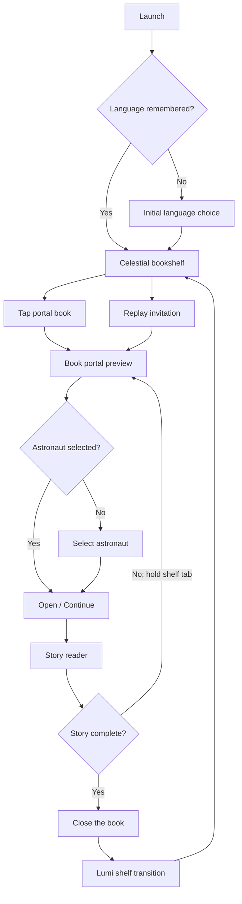

# UX Specification: Aby Little Book

**Status:** Draft 1  
**Product stage:** Private family prototype  
**Primary experience:** *The Starlight Rescue* / *Penyelamatan Cahaya Bintang*  
**Primary platform:** iPad, landscape orientation, touch input  
**Supporting platforms:** Phone and desktop web browsers  
**Last updated:** 2026-08-11

## 1. Purpose

This document defines how the child and parent move through Aby Little Book, how each screen is organized, and how controls, gestures, feedback, responsive layouts, and accessibility states behave.

It is the source of truth for presentation and interaction behavior. The Product Requirements Document defines product scope, while the Story Specification defines narrative content and story-specific scene interactions. The later Art Bible will define the final visual style without changing the interaction hierarchy established here.

## 2. Experience Statement

Aby Little Book should feel like opening a treasured picture book inside a quiet celestial reading nook. The interface should make the story world feel magical while remaining calm, legible, predictable, and easy for a child aged 4–6 to operate.

The memorable interaction is not a dashboard or game reward. It is this sequence:

1. A book on the shelf softly reveals its world.
2. The child chooses an astronaut and opens the book.
3. The illustrated spread responds gently to reading and discovery.
4. The child closes the completed book.
5. Lumi appears on the shelf as a lasting reminder of the rescue.

> A book brought gently to life—not a game with text added to it.

## 3. UX Goals

The prototype UX must:

1. Let a child identify, open, read, and complete the available book with little assistance.
2. Keep story text visually clear and central to the experience.
3. Make word pronunciation available without opening a separate learning mode.
4. Make navigation discoverable without covering the artwork in controls.
5. Offer one meaningful route choice without implying that one choice is correct.
6. Keep optional discoveries inviting but non-blocking.
7. Prevent accidental exits and destructive resets.
8. Support shared parent-child reading without requiring a separate parent mode.
9. Preserve a book-like rhythm across iPad, phone, and desktop layouts.
10. Remain understandable when motion, sound, or network access is unavailable.

## 4. UX Principles

### 4.1 Reading first

- Story prose receives higher visual priority than instructions or controls.
- No interface element should resemble a score, streak, quest log, or game HUD.
- Optional interactions must not delay page turns.
- The reader must not automatically narrate or advance.

### 4.2 Calm magic

- Resting screens use little or no continuous motion.
- Motion begins mainly in response to touch or at one deliberate transition.
- Hints use one restrained cycle rather than persistent bouncing or flashing.
- Sound effects are brief, soft, and subordinate to word pronunciation.

### 4.3 Forgiving control

- Important touch targets are large and separated.
- A swipe and a tap-edge action lead to the same page-turn result.
- Optional targets never create failure feedback.
- Destructive actions require an adult gate and confirmation.

### 4.4 No hidden learning rules

- Every visible story word is tappable, not only selected vocabulary.
- Both story routes are presented with equal emphasis.
- A child does not need to complete a discovery to understand the next spread.

### 4.5 Art supports use

- Every scene contains a deliberate text-safe region.
- Faces, route targets, required actions, and essential storytelling stay outside the center fold and crop-loss zones.
- Controls remain interface elements and are never baked into rendered artwork.

## 5. Users and Operating Context

### 5.1 Child

- Age 4–6
- Uses touch before reading interface labels fluently
- May read independently or with a parent
- Benefits from immediate visual and audio feedback
- May make imprecise gestures or repeat a tap

### 5.2 Parent or caregiver

- May sit beside the child and read aloud
- May help with initial language or astronaut selection
- Controls sound and reset behavior
- Does not sign in or create a profile

### 5.3 Primary session

- Device: family iPad
- Orientation: landscape
- Input: touch
- Duration: 5–7 minutes
- Environment: home, commonly seated together
- Connectivity: may disappear after the book has been prepared

## 6. Information Architecture

```text
Aby Little Book
├── Initial language choice (first use only)
├── Celestial bookshelf
│   ├── Story portal book
│   ├── Lumi keepsake (after completion)
│   ├── Language control
│   └── Parent-gate affordance
├── Book portal preview
│   ├── Cover and world preview
│   ├── Open / Continue / Read Again
│   ├── Language selection
│   └── Astronaut selection
├── Story reader
│   ├── Illustrated spread
│   ├── Story text panel
│   ├── Word pronunciation
│   ├── Optional scene discovery
│   ├── Route choice
│   ├── Page navigation
│   └── Protected shelf exit
└── Parent controls
    ├── Word-pronunciation sound
    ├── Effects sound
    └── Reset story data
```

The prototype must not show empty book slots, locked content, purchase prompts, or fake future books merely to make the shelf look populated.

## 7. Application Flow



### 7.1 Story state reflected in primary action

| Story state | Primary preview action | Result |
|---|---|---|
| Never started | **Open Book** / **Buka Buku** | Open Spread 01 |
| In progress | **Continue** / **Lanjutkan** | Restore the saved spread and route |
| Completed | **Read Again** / **Baca Lagi** | Begin a new playthrough at Spread 01 |

A completed story does not immediately erase route-discovery history. A replay resets only the active playthrough and permits a new route selection.

## 8. Responsive Layout Classes

Exact CSS breakpoints belong in the Technical Design Document. The UX uses three behavioral layout classes.

| Layout class | Typical device | Reader behavior |
|---|---|---|
| Book spread | Landscape iPad and sufficiently wide desktop | Two-page visual book with center fold |
| Single page | Phones and narrow windows | One scene page with reorganized text panel |
| Rotate request | Portrait iPad/tablet matching the primary-device rule | Gentle prompt to rotate before reading |

### 8.1 Book-spread class

- Center the physical-book surface within a quiet surrounding margin.
- Preserve the visible center fold, but never place essential content or words on it.
- Render artwork across both pages as one coordinated scene.
- Place the story panel in the scene's authored text-safe region.
- Keep shelf-exit and progress affordances attached visually to the book, not floating as a dashboard toolbar.

### 8.2 Single-page class

- Show one complete scene at a time without imitating a squeezed two-page spread.
- Move the text panel to the authored mobile-safe position; it may sit below the main focal area when necessary.
- Preserve story order, available words, route choices, and optional interactions.
- Use the same swipe and tap-edge navigation model.
- Avoid cropping primary characters, Lumi, and required route targets.

### 8.3 Desktop adaptation

- Keep the book-spread presentation where width permits.
- Support click, keyboard focus, Enter/Space activation, and arrow-key page navigation.
- Do not introduce hover-only instructions or interactions.

## 9. Global Visual Hierarchy

The final palette and materials remain deferred to the Blender spike and Art Bible. The UX hierarchy is fixed:

1. **Primary:** Story characters, narrative action, and story text
2. **Secondary:** Required route choice or current optional discovery
3. **Tertiary:** Page edges, bookmark progress, shelf exit, language, and parent access
4. **Atmospheric:** Shelf details, stars, glows, and decorative motion

Atmospheric elements must not be brighter, larger, or more active than the current reading action.

## 10. Initial Language Choice

### 10.1 First launch

If no interface language is stored, show a minimal language choice before the bookshelf. Each option uses its own native label:

- **English**
- **Bahasa Indonesia**

Do not use flags as the sole or primary language identifier.

### 10.2 Behavior

- Both options have equal size and emphasis.
- Selecting an option immediately applies it to the entire application and opens the bookshelf.
- The choice is remembered locally.
- The language can later be changed from the bookshelf or portal preview.
- Changing language never creates or resets narrative progress.

## 11. Celestial Bookshelf

### 11.1 Concept

The bookshelf is a warm celestial reading nook, not a cover grid. It should combine the familiarity of a crafted shelf with a quiet view of the night sky. The single story book is the unmistakable focal object.

### 11.2 Required elements

- One large portal book for *The Starlight Rescue*
- Localized book title
- Subtle current-progress treatment when unfinished
- Lumi keepsake area, empty without looking locked before completion
- Language control labeled with the current language
- Small, unobtrusive parent-gate affordance

### 11.3 Portal-book states

| State | Shelf treatment |
|---|---|
| New | Closed cover with a slow, one-time glimmer when the shelf settles |
| In progress | A slim bookmark remains visible; no percentage or score |
| Completed, one route seen | Lumi is present and the cover briefly reveals a quiet motif from the undiscovered route |
| Completed, both routes seen | Lumi remains present; the book rests in a calm completed state |

The alternate-route invitation must be discoverable but subtle. It must not use an alert badge, exclamation mark, lock, or completion percentage.

### 11.4 Book selection

- The whole visible book and its immediate halo form one large target.
- A successful tap gives immediate pressed feedback and begins the portal transition.
- Repeated taps during the transition are ignored.
- The shelf should not require horizontal scrolling for the prototype.

### 11.5 Keepsake behavior

- Before completion, do not show a grey silhouette or locked Lumi.
- On first completion, Lumi transitions visually from the ending into a natural place on the shelf.
- On later visits, Lumi may acknowledge one tap with a small glow and wave.
- Lumi is a story-world resident, not a badge button, currency, or navigation item.

## 12. Book Portal Preview

### 12.1 Purpose

The preview provides a calm threshold between the shelf and story. It lets the child see the selected language and astronaut without forcing repeated setup.

### 12.2 Layout

- A large cover or portal preview occupies the visual center.
- The current astronaut appears by name and portrait beneath or beside the preview.
- The current language appears as a secondary selection control.
- One large state-dependent primary action sits within easy reach.
- A small back-to-shelf action remains available.

### 12.3 First use

- No astronaut is preselected silently on first use.
- The preview asks the child to choose Aby, Maya, or Niko.
- Selection cards use portrait plus name and equal visual weight.
- After selection, the primary **Open Book** action becomes available.

### 12.4 Returning use

- The remembered astronaut and language remain visible.
- The child can activate **Continue** immediately.
- **Change Astronaut** and language controls remain secondary but plainly available.
- The interface must not ask for confirmation when nothing has changed.

### 12.5 Changing the astronaut during progress

Changing the selected astronaut updates the character and resolved prose without resetting the saved spread or route. The change applies when the reader is opened again. The interface does not frame one astronaut as the original or correct choice.

## 13. Reader Anatomy

The landscape iPad reader consists of:

1. Quiet environment surrounding the book
2. Physical-book surface and center fold
3. Layered scene artwork spanning the spread
4. Dedicated story text panel in the authored safe region
5. Optional scene target layer
6. Left and right edge navigation zones
7. Bookmark progress ribbon
8. Hold-to-exit shelf bookmark

No persistent top navigation bar is used during reading.

### 13.1 Conceptual landscape wireframe

```text
┌──────────────────────────────────────────────────────────────────────┐
│                        quiet reader surround                         │
│   ┌──────────────────────── BOOK SURFACE ────────────────────────┐   │
│   │  ‹ edge tab                                      edge tab ›  │   │
│   │                                                            │   │
│   │       layered story art      │      primary story action    │   │
│   │                              │                              │   │
│   │   ┌──────────────────────┐   │              ◉ target        │   │
│   │   │ paper-like text panel│   │                              │   │
│   │   │ tappable story words │   │                              │   │
│   │   └──────────────────────┘   │                              │   │
│   │                         center fold                         │   │
│   └────────────────────────────────────────────────────────────┘   │
│             progress ribbon                       hold shelf tab    │
└──────────────────────────────────────────────────────────────────────┘
```

The text panel may move between the left and right page from spread to spread according to the approved text-safe region. Its visual treatment and reading behavior remain consistent.

## 14. Story Text Panel

### 14.1 Presentation

- Use an opaque or strongly translucent paper-like surface that guarantees text contrast over artwork.
- Keep the panel visually integrated with the book rather than styled like an application modal.
- Display only the active language.
- Show no more than the specified one or two sentences.
- Never require scrolling at the primary iPad size.
- Do not animate sentences into view word by word.

### 14.2 Readability targets

- Target a comfortable iPad story-text size in the approximate 28–36 CSS pixel range, validated on the physical test device.
- Use generous line spacing and a short line length suitable for emerging readers.
- Use a highly legible story typeface with clearly distinguishable letterforms.
- Avoid all caps for sentences and avoid decorative type for body text.
- The final typeface choice belongs in the Art Bible, but readability overrides theme.

### 14.3 Responsive behavior

- The panel may change width and position to fit the authored safe region.
- It must not cover a face, required route target, Lumi, or the current optional target.
- Indonesian text must fit without reducing type below the approved readable minimum.
- If content cannot fit, revise the prose or safe region rather than adding a scroll area.

## 15. Word Pronunciation Interaction

### 15.1 Targeting

- Every visible story word is an independent semantic button while retaining natural sentence flow.
- Punctuation remains visible but is excluded from the spoken value.
- Word targets include forgiving internal padding without creating visibly irregular spacing.
- A word tap must not trigger the scene interaction beneath the panel.

### 15.2 Feedback sequence

1. Child taps a word.
2. Any current word speech stops cleanly.
3. The selected word receives a warm highlight and slight visual lift/enlargement.
4. The isolated word is pronounced in the active language.
5. Highlight returns gently to rest when speech ends or is replaced by another word.

Do not show a definition, translation bubble, score, phonics breakdown, or separate vocabulary panel in the prototype.

### 15.3 Repeated taps

- Rapid taps never produce overlapping voices.
- Tapping the active word restarts it only after the existing utterance is cancelled.
- Tapping another word transfers the highlight immediately.
- Page navigation cancels speech and removes the highlight.
- Interaction effects yield to word pronunciation and may resume only if still relevant.

### 15.4 Sound-disabled state

If word pronunciation is disabled in parent controls, tapping still provides the visual highlight. The interface does not show an error to the child.

## 16. Page Navigation

### 16.1 Supported actions

- Swipe left: next spread
- Swipe right: previous visited spread
- Tap right edge: next spread
- Tap left edge: previous visited spread
- Desktop right/left arrow keys: next/previous visited spread

Physical direction stays left-to-right in both English and Indonesian.

### 16.2 Edge affordances

- Show quiet, persistent edge tabs rather than large arrow buttons.
- Each tab has a generous invisible target extending inward from the page edge.
- The visual tab remains subordinate to text and artwork.
- Hide or disable the previous tab on Spread 01.
- Replace the next tab on Spread 03 until a route has been selected.
- On Spread 10, replace next-page behavior with the explicit close-book action.

### 16.3 Gesture conflict rules

- A gesture beginning on a word, route choice, scene target, parent control, or shelf tab belongs to that control and must not turn the page.
- A mostly horizontal gesture beginning elsewhere may turn the page after a clear distance and direction threshold.
- A mostly vertical or short ambiguous gesture does nothing.
- Only one page transition can run at a time.
- Repeated taps during a transition are ignored.

Exact gesture thresholds and animation duration belong in the Technical Design Document and must be tuned on the target iPad.

### 16.4 Transition

- Use a brief page-like sweep or fold suggestion, not a physically simulated draggable sheet.
- Keep the transition fast enough that repeated reading does not feel delayed.
- Start the destination spread only after navigation is committed.
- Do not play a page sound when reduced effects or mute is active.
- Reduced-motion mode uses a short crossfade or immediate replacement.

## 17. First-Use Guidance

No blocking tutorial or spoken instruction is used.

### 17.1 Tappable-word hint

On the first spread of the first playthrough, one suitable story word receives one gentle highlight after the text settles. The highlight uses the same visual language as a real word tap but produces no speech until touched.

### 17.2 Page-turn hint

After the child has had time to read the first spread, the right edge tab gives one short inward movement or glow. It must not run while speech or a scene response is active.

### 17.3 Persistence

- Each first-use hint is marked seen after the child successfully performs its action.
- Hints do not replay on every session.
- Reduced-motion mode uses static emphasis.
- A parent reset may restore first-use hints.

## 18. Scene Discoveries and Hints

### 18.1 Optional discoveries

- Optional targets may respond to tap at any time while the spread is stable.
- Successful activation gives immediate visual feedback, then a brief gentle sound if enabled.
- The target does not open a modal, add prose to the text panel, or prevent navigation.
- Revisiting a spread may reset the discovery so it can be enjoyed again.

### 18.2 Hit areas

- Child-facing targets should aim for at least 56 by 56 CSS pixels at the primary layout, with larger forgiving hit regions where artwork allows.
- Hit regions must not overlap story words or edge-navigation zones.
- Transparent target bounds should follow the perceived object closely enough that feedback feels causal.

### 18.3 Inactivity hint

- Start the optional-target hint after approximately 7 seconds without touch, active speech, page transition, or scene response.
- Run one subtle pulse or authored equivalent, then return fully to rest.
- Do not repeat more often than once per additional inactivity period.
- Any touch resets the inactivity timer.
- Do not hint after the discovery has already been activated on the current visit.
- Reduced-motion mode uses a brief static outline or contrast emphasis without scaling or travel.

The seven-second value is the initial usability-test value and may be adjusted from observation without changing the story.

## 19. Route Choice

### 19.1 Layout

Spread 03 presents two large route cards or scene targets:

- **Asteroid Garden** / **Taman Asteroid**
- **Singing Starfield** / **Hamparan Bintang Bernyanyi**

Both targets must have:

- Equal size and placement weight
- Equally warm, inviting imagery
- Localized text labels
- Distinct shape or imagery in addition to color
- No checkmark, difficulty, reward, or recommendation before selection

### 19.2 Selection sequence

1. Child taps either route.
2. The chosen route responds immediately with a gentle outline or glow.
3. Its path traces across the map.
4. The route choice is persisted locally.
5. The next-page edge becomes available.

The unchosen route remains visible and appealing. It must not dim into a failure state or display a cross.

### 19.3 Locked route behavior

- Returning to Spread 03 shows the selected route as the traveled path.
- Both labels remain readable, but the unchosen route is not actionable.
- A small localized line may state **This is our path for this journey** / **Ini jalan kita untuk perjalanan ini**.
- Do not provide an override inside the reader.
- Completing and starting **Read Again** creates a fresh route choice.

## 20. Bookmark Progress Ribbon

### 20.1 Purpose

The progress ribbon communicates that the child is moving through a physical book without exposing percentages, points, or a level map.

### 20.2 Behavior

- Attach the ribbon visually to the lower book edge.
- Advance it in ten calm positions corresponding to the ten spreads in a playthrough.
- Do not expose branch letters or route structure.
- Do not make ribbon positions directly selectable.
- Provide an accessible text equivalent such as “Spread 4 of 10” for assistive technology and desktop focus, without requiring it to be visually prominent.

The ribbon indicates current position, not completion quality.

## 21. Leaving and Resuming the Reader

### 21.1 Protected shelf exit

- A bookmark-shaped shelf control remains visible at the outer lower edge of the book.
- The child or parent presses and holds it briefly to return.
- A visible fill or glow communicates hold progress.
- Releasing early cancels the action without penalty.
- Completion of the hold saves the stable spread and returns to the portal preview, from which the shelf is one clear action away.

The hold is protection against accidental taps, not a parent gate.

### 21.2 Save point

Persist the current stable spread after each completed page transition, together with language-independent progress, astronaut, active route, route-discovery history, settings, and keepsake state.

### 21.3 Resume

- The portal preview shows **Continue** for an unfinished story.
- Activating it restores the saved spread directly; there is no chapter picker or recap.
- The selected astronaut, active language, route, and discovered-route state are restored.
- A brief book-opening transition may play, but no setup confirmation is required.

## 22. Ending, Book Close, and Keepsake

### 22.1 Final spread

- Spread 10 remains fully readable and interactive.
- Tapping Lumi is optional and does not determine completion.
- After the spread settles, a clear **Close the Book** / **Tutup Buku** action becomes available in place of next-page navigation.
- The action should resemble closing or finishing the physical book, not claiming a reward.

### 22.2 Completion transition

1. Child activates the close-book action.
2. The pages close with a brief, calm transition.
3. Lumi's glow bridges from the story world to the shelf.
4. The shelf appears with Lumi in the keepsake area.
5. If one route remains unseen, the portal book briefly reveals a motif from that route.

The transition must not use confetti, applause, stars-as-points, a score, or a full-screen reward dialog.

### 22.3 Replay invitation

- The shelf itself provides the invitation; no modal interrupts the completion moment.
- Opening the completed book shows **Read Again**.
- The preview may include a short localized line such as **Another path is waiting** / **Jalan lain masih menunggu** while one route remains unseen.
- Once both routes have been completed, the replay action remains available without implying unfinished work.

## 23. Parent Gate and Controls

### 23.1 Entry affordance

- Place a small parent icon or label on the bookshelf, away from the portal book.
- It must be discoverable to an adult but visually uninteresting compared with the story.
- Press and hold to begin; show hold-progress feedback.
- Releasing early returns the control to rest.

### 23.2 Written action prompt

After a successful hold, show one localized written sequence intended for an adult, for example:

> Touch the moon, then the blue star.  
> Sentuh bulan, lalu bintang biru.

The named symbols appear as large choices in randomized positions. The order and requested attribute should vary among a small reviewed set so the gate is not a single memorized tap.

This is a lightweight child deterrent for a private prototype, not authentication or a security boundary.

### 23.3 Prompt behavior

- Correct sequence opens parent controls.
- Incorrect selection clears the sequence and allows another attempt without alarming feedback.
- A visible close action returns to the bookshelf.
- The prompt has no countdown or lockout.
- Symbols must differ by shape as well as color.

### 23.4 Parent control contents

The prototype panel contains only:

1. **Word pronunciation** on/off
2. **Sound effects** on/off
3. **Reset story data**

No child profile, account, analytics, content store, or AI-generation controls appear.

### 23.5 Reset flow

1. Parent selects **Reset story data** / **Atur ulang data cerita**.
2. A confirmation states that reading position, route history, astronaut choice, and Lumi keepsake will be removed from this device.
3. **Cancel** is visually safer and receives initial focus.
4. The parent must explicitly select **Reset**.
5. On success, return to the new-book shelf state.

Language and sound settings should remain unless the confirmation explicitly offers a separate full-settings reset. The prototype's default reset affects story data only.

## 24. Orientation Behavior

### 24.1 Portrait iPad

When the primary iPad is held in portrait during reading:

- Preserve the current spread and all progress.
- Replace the reader with a calm rotate-device prompt.
- Show a simple book-and-device illustration plus localized text.
- Do not play repeated motion or sound.
- Restore the same spread immediately when landscape returns.

Suggested copy:

- **Turn the iPad sideways to open the whole book.**
- **Putar iPad ke samping untuk membuka seluruh buku.**

The bookshelf and parent controls may remain usable in portrait if their layouts fit safely. The rotate request is required for the primary two-page reading experience, not as a global application lock.

### 24.2 Phone portrait

Phones use the single-page layout rather than the iPad rotate prompt. Device classification must rely on available layout space and capability rather than user-agent strings alone.

## 25. Loading, Offline, and Recovery States

### 25.1 Initial book preparation

- The portal preview may show a calm preparation state while required assets are first made available.
- Use plain localized language, such as **Preparing your book…** / **Menyiapkan bukumu…**.
- If progress is measurable, show a quiet determinate indicator without technical file counts.
- Do not allow the book to open until all assets required for the complete route structure and shared ending are available offline.

### 25.2 Prepared offline state

- Once prepared, the story opens normally without network access.
- Do not display an offline warning if all required behavior remains available.
- Local reading, route choice, interactions, completion, and keepsake behavior remain unchanged.

### 25.3 Pronunciation limitation

If the browser voice is unavailable offline and no reviewed fallback is present, the book has not met prototype acceptance. During development only, word taps may still highlight while a parent-facing diagnostic indicates that pronunciation requires attention. Do not present repeated technical errors to the child.

### 25.4 Asset failure

If a required scene cannot load:

- Keep progress intact.
- Stop before entering a visually incomplete spread.
- Offer a localized retry action.
- Provide a simple path back to the preview.
- Never silently skip story content.

## 26. Motion

### 26.1 Motion hierarchy

1. Page opening, closing, and completion transitions
2. Direct responses to child interaction
3. One-time discovery hints
4. Minimal atmospheric shelf motion

### 26.2 Rules

- Avoid continuous bobbing, twinkling everywhere, parallax tied to device motion, and autoplay character loops across the reader.
- Keep interaction responses short and causally connected to the touched object.
- Do not animate text while the child is trying to read it.
- Pause or suppress hints during page motion and speech.
- Avoid flashes, rapid scaling, and large unexpected movement.

### 26.3 Reduced motion

When reduced motion is requested:

- Replace page turns with a short crossfade or immediate swap.
- Replace target pulses with a static outline or contrast change.
- Remove route-trace travel while retaining a clear selected state.
- Keep all content and interactions available.

## 27. Sound

### 27.1 Sound categories

- Isolated word pronunciation
- Page-turn effect
- Scene-discovery effects
- Route-confirmation effect
- Completion shimmer

There is no music, ambience, automatic prose narration, or spoken interface instruction.

### 27.2 Priority

Word pronunciation has the highest audio priority. When it starts:

- Cancel any previous word utterance.
- Duck, pause, or stop scene effects.
- Do not start a page-turn effect over the word.

### 27.3 Defaults

- Word pronunciation defaults on.
- Gentle effects default on.
- Settings persist locally.
- Muted states do not remove equivalent visual feedback.

## 28. Accessibility and Child Usability

### 28.1 Touch and pointer

- Aim for at least 56 by 56 CSS pixels for primary child targets.
- Adult-only controls must meet at least standard accessible target sizing.
- Do not place multiple small targets tightly together.
- Provide clear pressed, selected, disabled, and focus-visible states.

### 28.2 Text and contrast

- Story and control text must meet WCAG AA contrast against their rendered surfaces.
- Never rely on a variable illustration region as the only text background.
- Keep localization from causing clipping or illegibly small type.
- Use shape, label, or position in addition to color for state communication.

### 28.3 Keyboard and semantics

- Use semantic buttons for words, books, route choices, and controls.
- Preserve a logical focus order that follows visual reading order.
- Provide visible keyboard focus.
- Support Enter/Space activation and arrow-key page navigation on desktop.
- Do not move keyboard focus unexpectedly when scene animation completes.

### 28.4 Assistive descriptions

- Decorative rendered layers use empty alternative text.
- Each spread has one concise scene description available to assistive technology.
- Interactive targets have localized accessible names describing the action, such as **Light the crystal** rather than raw asset names.
- The route choice exposes its selected and unavailable states semantically.

### 28.5 Timing and mistakes

- No child action has a countdown.
- No optional interaction has a failure state.
- Repeated or imprecise taps do not produce scolding sounds or messages.
- Holds communicate progress and allow safe cancellation.

## 29. Localization UX

### 29.1 Scope

English and Indonesian apply to:

- Initial language choice
- Bookshelf and title
- Portal preview
- Astronaut selection
- Story prose
- Route labels
- Reader instructions and accessible labels
- Rotate prompt
- Loading and recovery states
- Parent gate and settings
- Reset confirmation
- Completion and replay invitation

### 29.2 Rules

- Display one language at a time.
- Do not place one language as a subtitle beneath the other.
- Keep proper names Aby, Maya, Niko, and Lumi unchanged.
- Keep physical reading and navigation direction left-to-right in both languages.
- Controls must tolerate Indonesian expansion without truncation.
- Language switching changes interface and prose immediately but not progress.
- All final child-facing and parent-facing strings require fluent-adult review.

## 30. Key Screen Wireframes

These wireframes define hierarchy, not final style or exact dimensions.

### 30.1 Bookshelf

```text
┌──────────────────────────────────────────────────────────────┐
│  Aby Little Book                         English ▾   Parent  │
│                                                              │
│                  quiet celestial window                      │
│                                                              │
│              ╭────────────────────────╮                      │
│              │  THE STARLIGHT RESCUE  │  ← portal book      │
│              │       cover world      │                      │
│              ╰────────────────────────╯          Lumi ○      │
│                    crafted shelf                             │
└──────────────────────────────────────────────────────────────┘
```

Lumi is absent before completion. The parent control is intentionally low emphasis.

### 30.2 Portal preview

```text
┌──────────────────────────────────────────────────────────────┐
│  ‹ Shelf                                                     │
│                                                              │
│       ┌──────────────────────┐   Astronaut                   │
│       │ animated cover/portal│   [ Aby ] [ Maya ] [ Niko ]   │
│       │ world preview        │                               │
│       └──────────────────────┘   Language: English           │
│                                                              │
│                         [       Open Book       ]             │
└──────────────────────────────────────────────────────────────┘
```

On returning visits, astronaut choices may collapse to the current portrait plus a **Change** action, preserving the same information hierarchy.

### 30.3 Route choice spread

```text
┌──────────────────────────────────────────────────────────────┐
│ ‹ │  story text panel   │ fold │  two equal route worlds │ › │
│   │ Which way should…?  │      │ ┌────────┐  ┌────────┐  │   │
│   │                     │      │ │Garden  │  │Stars   │  │   │
│   │                     │      │ └────────┘  └────────┘  │   │
│   └─────────────────────┴──────┴─────────────────────────┘   │
│              bookmark progress        hold shelf tab         │
└──────────────────────────────────────────────────────────────┘
```

The next edge is unavailable until either equal route target is selected.

### 30.4 Parent controls

```text
┌─────────────────────────────────────────┐
│ Parent controls                       × │
│                                         │
│ Word pronunciation              On  ◉   │
│ Sound effects                   On  ◉   │
│                                         │
│ [ Reset story data ]                    │
└─────────────────────────────────────────┘
```

## 31. Screen and State Inventory

| ID | Screen or state | Required variants |
|---|---|---|
| UX-01 | Initial language choice | English/Indonesian selection |
| UX-02 | Bookshelf | New, in progress, completed-one-route, completed-both-routes |
| UX-03 | Portal preview | No astronaut, new, continue, replay, preparing, recovery |
| UX-04 | Astronaut selection | Aby, Maya, Niko, selected/focus states |
| UX-05 | Reader spread | Shared, Route A, Route B, final |
| UX-06 | Story text | Rest, word pressed, speaking, sound-disabled |
| UX-07 | Optional target | Rest, hinted, active, completed, reduced-motion |
| UX-08 | Route choice | Unselected, selected, locked on revisit |
| UX-09 | Navigation | Previous unavailable, next available, choice-blocked, transitioning |
| UX-10 | Reader exit | Rest, holding, cancelled, complete |
| UX-11 | Rotate request | English and Indonesian |
| UX-12 | Completion | Final spread, close-book, shelf transition, replay invitation |
| UX-13 | Parent gate | Rest, holding, prompt, incorrect, accepted |
| UX-14 | Parent controls | Sound states, reset confirmation, reset complete |
| UX-15 | Offline/loading | Preparing, prepared, retryable asset failure |

## 32. Usability Observation Points

During family testing, observe without prompting where practical:

1. First object tapped on the shelf
2. Whether the child recognizes the book as selectable
3. Whether language and astronaut selection are understood
4. Whether the child notices or uses **Open Book**
5. First successful word tap and whether the feedback is understood
6. First page turn and whether swipe or edge tap is preferred
7. Accidental page turns while touching words or scene targets
8. Whether optional-target hints are noticed without becoming distracting
9. Whether both route choices appear equally acceptable
10. Whether the locked route is understood on backward review
11. Whether the child remains through Spread 10
12. Whether **Close the Book** is understood
13. Whether Lumi is recognized on the shelf
14. Whether the alternate-route invitation leads to voluntary replay
15. Every point where an adult must explain the interface

These observations are recorded manually. The private prototype includes no analytics or child-behavior tracking.

## 33. UX Acceptance Criteria

The UX Specification is satisfied when the implemented prototype demonstrates that:

1. A first-time child can identify the portal book and reach its preview with little or no instruction.
2. Initial language and astronaut selection are clear, equal, and remembered locally.
3. Returning users can continue without repeating configuration.
4. The target iPad shows a stable, book-like two-page spread in landscape.
5. Every spread has a readable, non-scrolling text panel that avoids essential art and targets in both languages.
6. Every visible story word gives immediate warm-highlight feedback and isolated pronunciation without overlapping speech.
7. Swipe and edge-tap navigation work without stealing gestures from words, targets, or protected controls.
8. First-use hints teach word tapping and page turning without a blocking tutorial.
9. Optional discoveries remain skippable and use no persistent attention-grabbing motion.
10. The route choice gives both options equal weight, blocks forward progress only until selection, and remains locked for that playthrough.
11. The bookmark ribbon communicates position without appearing to score the child.
12. Leaving the reader requires a clear short hold and never loses the saved spread.
13. Completing the final spread requires only the explicit close-book action, not the optional Lumi interaction.
14. Lumi transitions to and persists on the shelf without a game-like reward screen.
15. A subtle alternate-route invitation supports replay without interrupting the ending.
16. The parent gate resists casual child entry and exposes only pronunciation, effects, and reset controls.
17. Reset requires explicit confirmation and does not accidentally remove language or sound preferences.
18. Portrait iPad reading preserves state and shows a gentle rotate request; phones receive a functional single-page layout.
19. Core reading remains understandable with sound muted and with reduced motion enabled.
20. The prepared story remains navigable offline without child-facing technical errors.

## 34. Dependencies and Handoffs

### 34.1 Blender Spike Brief must provide

- A representative two-page scene using the defined text-safe and fold-safe regions
- Separately testable background, character, interactive-target, foreground, and effect layers
- A phone crop demonstrating the single-page layout
- A target large enough for the child hit-area requirements
- Evidence that the panel does not obscure focal storytelling

### 34.2 Art Bible must define

- Final visual direction, palette, texture, and lighting
- Story and interface typography
- Book, panel, ribbon, tab, and shelf-control appearance
- Character and keepsake motion language
- Safe-region templates for spread and phone compositions
- Final motion durations and easing ranges in cooperation with implementation

### 34.3 Technical Design Document must define

- Responsive breakpoints and layout implementation
- Story and UI state machines
- Gesture thresholds and event-priority handling
- Speech synthesis and audio fallback implementation
- Local persistence and reset boundaries
- Offline asset preparation and recovery model
- Accessibility semantics and focus management
- Asset size and performance budgets

### 34.4 Test and Usability Plan must define

- Automated coverage for screen and interaction states
- Physical iPad test cases
- English and Indonesian layout and pronunciation checks
- Offline, reduced-motion, keyboard, and reset matrices
- Family observation protocol and recording template

## 35. Open Design Decisions

The following remain intentionally open until the Blender spike, Art Bible, or device testing provides evidence:

- Final shelf, book, text-panel, ribbon, and edge-tab styling
- Final typefaces and exact type scale
- Exact responsive breakpoints and safe-area dimensions
- Exact swipe distance, velocity, and hold durations
- Final page-turn and completion-transition timing
- Final approved language for all interface strings
- Final iconography for language, parent access, rotate request, and sound
- Whether browser pronunciation is acceptable enough to retain
- Final asset-loading indicator after representative file sizes are known
- Adjustment of the initial seven-second interaction-hint delay after observation

Changes to visual styling may proceed without revising this document when they preserve hierarchy, behavior, accessibility, and acceptance criteria.
